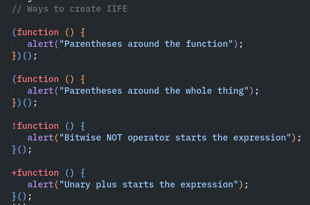

# <center>Javascript Notes</center>

### "this" keyword:

1.  in global space value of "this" depends on global object which can be acccessed through "globalThis" keyword. Now value of globalThis depends on different environments, like in DOM it is window.
2.  Inside functions it depends on strict or non strict mode.
    - in strict mode its "undefined".
    - in non strict its globalThis. Why? because of "this substitution". "This substitution"??: whenever the value of "this" in "undefined" or "null" it becomes globalThis, but, but... only in non strict mode. So this substitution works only in non strict mode.
    - but in both strict and non strict mode if we provide a context, the value of this will depend on that context.
      ```js
      "use strict";
      function a() {
      	return this;
      }
      a(); // undefined
      window.a(); // window object.
      ```
3.  inside objects "this" depends on the object

    ```js
    const user = {
        name: "One",
        printName: function {
            return this.name // this refers to the user object
        }
    }
    console.log(user.printName) // One
    ```

    - but if we want to use different object as context use "call", "apply", "bind" methods.
      ````js
      // example of "call"
      const user = {
      name: "One",
      printName: function {
      return this.name // this refers to the user object
      }
      }
      const anotherUser = {
      name: "Two"
      }
               console.log(user.printName.call(anotherUser)) // Two
           ```
      so we called the user's printName function but used anotherUser object as the context.
      ````

4.  Arrow function don't have their own this, they borrow the value of this from their lexical context. Lexical context means where the function was defined. So when the function was defined what was the value of "this", that will be the value of "this" inside the arrow function.

    ```js
    const person = {
    	name: "Alice",
    	y: this,
    	speak: () => {
    		console.log("arrow", this);
    	},
    	speak2: function () {
    		console.log("regular", this);
    	},
    	speak3: function () {
    		// new lexical context
    		const andarWala = () => {
    			console.log("andar wala arrow", this);
    		};
    		andarWala();
    	},
    };

    console.log(person.y); // window
    person.speak(); // window -> coz value of "this" was window when the function was defined.
    person.speak2(); // person
    person.speak3(); // person -> coz lexical context changed
    ```

### Symbol:

1. A "Symbol" is a unique identifier.
2. To create it we use "Symbol" keyword
   ```js
   let sym = Symbol();
   ```
3. We can give it a description:
   ```js
   let sym = Symbol("sym");
   ```
4. They are guaranteed unique even if they share the same description.
   ```js
   let sym1 = Symbol("sym");
   let sym2 = Symbol("sym");
   console.log(sym1 === sym2); // false
   ```
5. Use it as hidden properties in objects. In this way they can't be overwritten in any way.

   ```js
   let sym = Symbol("sym");
   user[sym] = "some kind of sym value";
   // if someone else has their own `sym` Symbol, it wont overwrite yours.

   // below a different example
   let user = { name: "Sarthak" };
   user.sym = "Original sym value";
   user.sym = "New sym value";
   // overwritten
   ```

6. They are skipped in for...in loops

   ```js
   let sym = Symbol("sym");
   let user = {
   	name: "Sarthak",
   	[sym]: 123,
   };

   for (let key in user) console.log(key); // name but no symbols

   console.log("Suymbol only", user[sym]); // 123
   ```

7. What is we want same-named symbols? we use Global Symbols. A global symbol registry exists, we create a symbol there and access it by the same name and it will return the same symbol. To do this we use Symbol.for("key") syntax.

   ```js
   let sym = Symbol.for("sym");
   let sameSymbol = Symbol.for("sym");
   console.log(sym === sameSymbol); // true
   ```

   Symbol.for tries to return the symbol, if not found it creates it first and then returns it.

   Now the above returns the symbol name, what if we want to return a name by global symbol, we use Symbol.keyFor(name) syntax

   ```js
   const symOne = Symbol.for("one");
   const symTwo = Symbol.for("two");

   console.log(Symbol.keyFor(symOne), Symbol.keyFor(symTwo)); // "one", "two"
   ```

### Garbage collection:

1.  It happens automatically in javascript, unlike some low level languages.
2.  Its all about reachability. If some value is not reachable in the object tree it is garbage collected.
3.  Any value is considered reachable if it can be reached from root by a reference or by chain of references.
    ```js
    const user = { name: "one" };
    const anotherUser = user;
    user = null;
    console.log(anotherUser); // {name: "one"}
    ```
    now above the object is still reachable through anotherUser variable so its not garbage collected.
4.  Main algorithm which is used in called "Mark-and-Sweep". As the names suggests, it starts from root and mark (remembers) it, then it goes to every node which can be visited through reference and marks them as well. It keeps doing this untill every reachable node is marked. Then the remaining unmarked are removed from the memory.
5.  There are some optimizations done by javascript engines to make the process of garbage collection faster and not introduce any delays into the code execution.
    Below are some of those optimizations:

    - **General collection:** Objects are grouped as "old" and "new". New objects are checked often because most die quickly, old ones are checked less often to save time. New ones, if used again ana again is then put in that old category so they are also checked less often.
    - **Incremental Collection:** Memmory is cleaned in small parts, not all at once. This avoids big pauses during the code execution. So we, user, don't notice any pause.
    - **Idle-time Collection:** Cleaning happens when CPU is idle. This reduces any slowdown in running code.

      There are more optimizations, but these are main.

### Transpilers and Polyfills

New syntax and features of languages don't work with older engines or browsers, to tackle this issue there are 2 tools that are used:

- **Transpilers**
- **Polyfills**

1. **Transpilers** are the piece of softwares that translates the source code to another source code. It means it takes modern syntax and rewrite it using older syntax so that older browsers can understand it.
   Eg. 'nullish coalescing operator' didn't existed in older version or Javascript, so it takes that and converts it into something else.

   ```js
   // before running the transpiler
   const height = height ?? 100;

   // after running the transpiler
   const height = height !== undefined && height !== null ? height : 100;
   ```

   Usually programmers runs the transpilers in their own computer and deploys the transpiled code to the server.

   **Babel** is one of the most used transpilers.

2. **Polyfills** are softwares that take new features and rewrites them in older ways. Eg. `Math.trunc` don't work in older engines so a polyfill will be created such that it will convert it to older syntax.
   ```js
   if (!Math.trunc) {
   	// if no such function
   	// implement it
   	Math.trunc = function (number) {
   		// Math.ceil and Math.floor exist even in ancient JavaScript engines
   		// they are covered later in the tutorial
   		return number < 0 ? Math.ceil(number) : Math.floor(number);
   	};
   }
   ```

### Object to primitive conversions

1. functions like `alert(...)` or `String(...)` expects string to be passed, but happens when we pass object instead of strings? It gets auto converted to primitive values.
2. There are 7 primitive types: `string`, `number`, `bigint`, `boolean`, `symbol`, `null` and `undefined`.
3. All objects are `true` when converted to boolean.
4. Numeric happens when we apply mathematical functions, like subtracting dates to get the difference.
5. String conversion happens when we try to output the object with like `alert(user)`.
   How does javascript decide which conversion to apply?: **Hints**
   There are 3 hints "string", "number", "default".

   1. "string" is used when we do operations that expects "string" argument like alert
   2. same thing with "number", when math is being done.
   3. "default" its a rare case, happens when operator is not sure what to use. Eg. "+" can be used with string and numbers both, same goes with `==`, `> <.

6. All built-in objects except for one case (Date object, we’ll learn it later) implement "default" conversion the same way as "number".
7. To do the conversion, JavaScript tries to find and call three object methods:
   1. Call `obj[Symbol.toPrimitive](hint)` – the method with the symbolic key Symbol.toPrimitive (system symbol), if such method exists.
   2. Otherwise if hint is "string", try calling obj.toString() or obj.valueOf(), whatever exists.
   3. Otherwise if hint is "number" or "default", try calling obj.valueOf() or obj.toString(), whatever exists.
8. **Symbol.toPrimitive:**

   ```js
   let user = {
   	name: "John",
   	money: 1000,

   	[Symbol.toPrimitive](hint) {
   		console.log(`hint: ${hint}`);
   		return hint == "string" ? `{name: "${this.name}"}` : this.money;
   	},
   };

   // conversions demo:
   console.log(user); // hint: string -> {name: "John"}
   console.log(+user); // hint: number -> 1000
   console.log(user + 500); // hint: default -> 1500
   ```

9. If no `Symbol.toPrimitive` is there then javascript tries to find `toString` and `valueOf` methods.

   1. For the "string" hint: call toString method, and if it doesn’t exist or if it returns an object instead of a primitive value, then call valueOf (so toString has the priority for string conversions).
   2. For other hints: call valueOf, and if it doesn’t exist or if it returns an object instead of a primitive value, then call toString (so valueOf has the priority for maths).
   3. By default, a plain object has following toString and valueOf methods:
      - The toString method returns a string "[object Object]".
      - The valueOf method returns the object itself.

   We can overwrite the `toString` and `valueOf`. Below eg. we will overwrite it to make sure it works like it normally works

   ```js
   let user = {
   	name: "John",
   	money: 1000,

   	// for hint="string"
   	toString() {
   		return `{name: "${this.name}"}`;
   	},

   	// for hint="number" or "default"
   	valueOf() {
   		return this.money;
   	},
   };

   console.log(user); // toString -> {name: "John"}
   console.log(+user); // valueOf -> 1000
   console.log(user + 500); // valueOf -> 1500
   ```

10. A conversion can return any type, like `toString` don't actually have to return "string". Then only mandatory thing it these methods must return a primitive.
11. As we know already, many operators and functions perform type conversions, e.g. multiplication \* converts operands to numbers.

If we pass an object as an argument, then there are two stages of calculations:

1.  The object is converted to a primitive (using the rules described above).
2.  If necessary for further calculations, the resulting primitive is also converted.

```js
let obj = {
	// toString handles all conversions in the absence of other methods
	toString() {
		return "2";
	},
};

console.log(obj * 2); // 4, object converted to primitive "2", then multiplication made it a number
```

```js
let obj = {
	toString() {
		return "2";
	},
};

console.log(obj + 2); // "22" ("2" + 2), conversion to primitive returned a string => concatenation
```

### Map

1. Map are like objects but main difference is it allows keys of any types. Below are the methods that can be applied to a Map.

   - `new Map()` – creates the map.
   - `map.set(key, value)` – stores the value by the key.
   - `map.get(key)` – returns the value by the key, undefined if key doesn’t exist in map.
   - `map.has(key)` – returns true if the key exists, false otherwise.
   - `map.delete(key)` – removes the element (the key/value pair) by the key.
   - `map.clear()` – removes everything from the map.
   - `map.size` – returns the current element count.

   ```js
   let map = new Map();

   map.set("1", "str1"); // a string key
   map.set(1, "num1"); // a numeric key
   map.set(true, "bool1"); // a boolean key

   // remember the regular Object? it would convert keys to string
   // Map keeps the type, so these two are different:
   console.log(map.get(1)); // 'num1'
   console.log(map.get("1")); // 'str1'

   console.log(map.size); // 3
   ```

2. Using objects as keys

   ```js
   let john = { name: "John" };

   // for every user, let's store their visits count
   let visitsCountMap = new Map();

   // john is the key for the map
   visitsCountMap.set(john, 123);

   console.log(visitsCountMap.get(john)); // 123
   ```

3. Iteration:

   - `map.keys()` – returns an iterable for keys,
   - `map.values()` – returns an iterable for values,
   - `map.entries()` – returns an iterable for entries [key, value], it’s used by default in `for..of`.

   ```js
   let recipeMap = new Map([
   	["cucumber", 500],
   	["tomatoes", 350],
   	["onion", 50],
   ]);

   // iterate over keys (vegetables)
   for (let vegetable of recipeMap.keys()) {
   	console.log(vegetable); // cucumber, tomatoes, onion
   }

   // iterate over values (amounts)
   for (let amount of recipeMap.values()) {
   	console.log(amount); // 500, 350, 50
   }

   // iterate over [key, value] entries
   for (let entry of recipeMap) {
   	// the same as of recipeMap.entries()
   	console.log(entry); // cucumber,500 (and so on)
   }
   ```

   Map also have inbuilt `forEach`

   ```js
   myMap.forEach((value, key, map) => {
   	console.log(value, key, map); // cucumber: 500 etc, map is the map itself here.
   });
   ```

4. Creating map from object

   ```js
   let obj = {
   	name: "John",
   	age: 30,
   };

   let map = new Map(Object.entries(obj));
   ```

5. Creating Object from map:

   ```js
   const myMap = new Map([
   	["one", 1],
   	["two", 2],
   ]);
   const myObj = Object.fromEntries(myMap);
   ```

   But as we know map can have object as keys, so if we create object from such a map, key will be `[object Object]`.

### Set

1. In a Set a value can accur only once. Its main methods are

   - `new Set([iterable])` – creates the set, and if an iterable object is provided (usually an array), copies values from it into the set.
   - `set.add(value)` – adds a value, returns the set itself.
   - `set.delete(value)` – removes the value, returns true if value existed at the moment of the call, otherwise false.
   - `set.has(value)` – returns true if the value exists in the set, otherwise false.
   - `set.clear()` – removes everything from the set.
   - `set.size` – is the elements count.

   ```js
   const mySet = new Set();
   mySet.add("one");
   mySet.add("two");
   mySet.add("one");
   for (const val of mySet) {
   	console.log(val); // one -> two.
   }
   // one won't be repeated again.
   ```

   Alternative to above is using array, but we would need to check the value inside itby `arr.find(...)` so the performance would be bad.

2. Iteration of `Set`:

   ```js
   let set = new Set(["oranges", "apples", "bananas"]);

   for (let value of set) console.log(value);

   // the same with forEach:
   set.forEach((value, valueAgain, set) => {
   	console.log(value, valueAgain, set);
   });
   ```

   In above 3 arguments are passed, set returns the set itself. But why we have value twice? Its to make it compatible with `Map`. This is strange, but in some scenarios this helps replacing `Map` with `Set` and vice-versa.

   - `set.keys()` – returns an iterable object for values,
   - `set.values()` – same as set.keys(), for compatibility with Map,
   - `set.entries()` – returns an iterable object for entries [value, value], exists for compatibility with Map.

### WeakMap

1. We know if object is reachable it won't be garbage collected.

   ```js
   let a = { name: "john" };
   const b = new Map();
   b.set(a, "something");
   a = null;
   ```

   still john object is in memory but weak map differs here. They don't stop garbage collection.

2. In WeakMap keys must be objects, else it throws error.

3. If object that is being used as key has no reference left, it will be removed from the memory.

   ```js
   let john = { name: "John" };

   let weakMap = new WeakMap();
   weakMap.set(john, "...");

   john = null; // overwrite the reference

   // john is removed from memory!
   ```

   So if john only exists as the key of WeakMap, it will be removed from memory, thus removing it from the WeakMap too.

4. WeakMap don't use iteration and methods like `keys()`, `values()`, `entries()`. It has only following methods.

   - weakMap.set(key, value)
   - weakMap.get(key)
   - weakMap.delete(key)
   - weakMap.has(key)

   Why though? Because as javascript engine don't do garbage collection immediately, it might wait to do it. So current count of elements inside WeakMap is not known.

5. Use cases:
   - If we are using some other data like a third party library, and we want to associate some data with it but only untill the third party library data is present, then we can use WeakMap. As if the third party library data is removed, its associated value will also be removed from the WeakMap.
   - In Caching. Using Maps, lets say we have an object and we want to associate some data with it. But in the future that object is removed, but it wont be garbage collected and its association will still be present in the ccache. On the other hand if we use WeakMap for caching, once the object is garbage collected, its associated data will also get removed from cache.

### WeakSet

1. `WeakSet` are kinda similar to `WeakMap` such that.

   - It is analogous to Set, but we may only add objects to `WeakSet` (not primitives).
   - An object exists in the set while it is reachable from somewhere else.
   - Like Set, it supports `add`, `has` and `delete`, but not `size`, `keys()` and no iterations.

   ```js
   let visitedSet = new WeakSet();

   let john = { name: "John" };
   let pete = { name: "Pete" };
   let mary = { name: "Mary" };

   visitedSet.add(john);
   visitedSet.add(pete);
   visitedSet.add(john);

   console.log(visitedSet.has(john)); // true
   john = null;
   console.log(visitedSet.has(john)); // false
   ```

### JSON

1. We have 2 main methods to convert things to JSON and vice-versa.

   - `JSON.stringify(...)`
   - `JSON.parse(...)`

   **JSON.stringify(...):**

   ```js
   const user = { name: "John", age: 20 };
   const str = JSON.stringify(user); // {"name": "John", "age": 20}
   ```

   Now JSON converts everything to string and it wraps them in double quotes.
   It supports following data types:

   - Objects
   - Arrays
   - primitives:
     - strings
     - numbers
     - booleans
     - null

   JSON is data only language independent specification, so some javascript object properties are skipped, mainly

   - functions
   - Symbolic keys and values
   - properties that store undefined.

   ```js
   let user = {
   	sayHi() {
   		// ignored
   		alert("Hello");
   	},
   	[Symbol("id")]: 123, // ignored
   	something: undefined, // ignored
   };

   console.log(JSON.stringify(user)); // {} (empty object)
   ```

   Nested objects are automatically converted. The only limitation? Circular references are skipped.

   ```js
   let room = {
   	number: 23,
   };

   let meetup = {
   	title: "Conference",
   	participants: ["john", "ann"],
   };

   meetup.place = room; // meetup references room
   room.occupiedBy = meetup; // room references meetup

   JSON.stringify(room); // Error: Converting circular structure to JSON
   ```

   Full syntax: **`JSON.stringify(value[,replacer, space])`**

   - **value:** value to encode
   - **replacer:** array of properties to encode or mapping functions `function(key, value)`
   - **space:** amount of space to use for formatting

   ```js
   let room = {
   	number: 23,
   };

   let meetup = {
   	title: "Conference",
   	participants: [{ name: "John" }, { name: "Alice" }],
   	place: room, // meetup references room
   };

   room.occupiedBy = meetup; // room references meetup

   console.log(JSON.stringify(meetup, ["title", "participants"]));
   // {"title":"Conference","participants":[{},{}]}
   ```

   The property list is applied to the whole object structure. So the objects in participants are empty, because name is not in the list.
   To include "name" pass "name" in array also.

   Now lets say object is too big and we just want to remove couple of properties, then we can use replacer function.

   ```js
   let room = {
   	number: 23,
   };

   let meetup = {
   	title: "Conference",
   	participants: [{ name: "John" }, { name: "Alice" }],
   	place: room, // meetup references room
   };

   room.occupiedBy = meetup; // room references meetup

   alert(
   	JSON.stringify(meetup, function replacer(key, value) {
   		alert(`${key}: ${value}`);
   		return key == "occupiedBy" ? undefined : value;
   	})
   );

   /* key:value pairs that come to replacer:
      :             [object Object]
      title:        Conference
      participants: [object Object],[object Object]
      0:            [object Object]
      name:         John
      1:            [object Object]
      name:         Alice
      place:        [object Object]
      number:       23
      occupiedBy: [object Object]
   */
   ```

   The first call is special. It is made using a special “wrapper object”: {"": meetup}. In other words, the first (key, value) pair has an empty key, and the value is the target object as a whole. That’s why the first line is ":[object Object]" in the example above.

   **Custom toJSON:**

   ```js
   let room = {
   	number: 23,
   };

   let meetup = {
   	title: "Conference",
   	date: new Date(Date.UTC(2017, 0, 1)),
   	room,
   };

   alert(JSON.stringify(meetup));
   /*
   {
      "title":"Conference",
      "date":"2017-01-01T00:00:00.000Z",  // (1)
      "room": {"number":23}               // (2)
   }
   */
   ```

   Here we can see that date (1) became a string. That’s because all dates have a built-in toJSON method which returns such kind of string.

   Now let’s add a custom toJSON for our object room (2):

   ```js
   let room = {
   	number: 23,
   	toJSON() {
   		return this.number;
   	},
   };

   let meetup = {
   	title: "Conference",
   	room,
   };

   alert(JSON.stringify(room)); // 23

   alert(JSON.stringify(meetup));
   /*
   {
      "title":"Conference",
      "room": 23
   }
   */
   ```

   **JSON.parse(...):**

   - Syntax: **`let value = JSON.parse(str[, reviver]);`**

   ```js
   const obj = { one: 1, two: 2, three: 3, four: 4 };
   const s = JSON.stringify(obj);

   const j = JSON.parse(s, (key, value) => {
   	return key === "three" ? undefined : value;
   });
   ```

   Above skips the "three" key value.

   ```js
   let str = '{"title":"Conference","date":"2017-11-30T12:00:00.000Z"}';

   let meetup = JSON.parse(str);

   console.log(meetup.date.getDate()); // Error!
   ```

   Gives error because date comes out as string.
   To fix this we use reviver.

   ```js
   let str = '{"title":"Conference","date":"2017-11-30T12:00:00.000Z"}';

   let meetup = JSON.parse(str, function (key, value) {
   	if (key == "date") return new Date(value);
   	return value;
   });

   console.log(meetup.date.getDate()); // now works!
   ```

### Rest paramenter `...`

1. A function can have n number of arguments. To capture all of them with one variable we use `...` operator

   ```js
   function sumAll(...args) {
   	// args is the name for the array
   	let sum = 0;
   	for (let arg of args) sum += arg;
   	return sum;
   }

   console.log(sumAll(1)); // 1
   console.log(sumAll(1, 2)); // 3
   console.log(sumAll(1, 2, 3)); // 6
   ```

   We can also choose to get couple of starting parameters as variables and put others in res

   ```js
   function showName(firstName, lastName, ...titles) {
   	console.log(firstName + " " + lastName); // Julius Caesar
   	// the rest go into titles array
   	// i.e. titles = ["Consul", "Imperator"]
   	console.log(titles[0]); // Consul
   	console.log(titles[1]); // Imperator
   	console.log(titles.length); // 2
   }

   showName("Julius", "Caesar", "Consul", "Imperator");
   ```

   **> Rest parameter always must be at the end**

2. In the old times there was no rest paramenter, so we just used `arguments` variable inside the function.

   ```js
   function showName() {
   	console.log(arguments.length);
   	console.log(arguments[0]);
   	console.log(arguments[1]);

   	// it's iterable
   	// for(let arg of arguments) alert(arg);
   }

   // shows: 2, Julius, Caesar
   showName("Julius", "Caesar");

   // shows: 1, Ilya, undefined (no second argument)
   showName("Ilya");
   ```

   `arguments` is array like and iterable, but we cant use array methods on it like `map`, `filter`, etc.

### Spread syntax

1. let say we have an array `[1, 2, 3]` and this can be of any length, and we want to use `Math.max` to find the number, then we can sprea the array by using spread syntax `...`

   ```js
   const arr = [5, 3, 1];
   console.log(Math.max(arr)); // NaN
   console.log(Math.max(...arr)); // 5
   ```

2. With spread syntax we can concatenate arrays too

   ```js
   const a = [1, 2, 3];
   const b = [5, 6, 7];
   const c = [0, ...a, 4, ...b]; // [1, 2, 3, 4, 5, 6, 7]
   ```

   We can do the same with objects.

   ```js
   const b = { one: 1, two: 2 };
   const c = { four: 4, five: 5 };
   const d = { zero: 0, ...b, three: 3, ...c };
   // {zero: 0, one: 1, two: 2, three: 3, four: 4, five: 5}
   ```

3. Spread syntax internally use iterators to gather elements, same as `for...of` does. So `for...of` for a string returns characters, thus spread operators returns array of characters.

   ```js
   const str = "Henlo";
   console.log([...str]); // ['a', 's', 'd', 'f']
   ```

4. We can use spread operator to clone arrays and objects. But remember, in case of objects, it only clone upto first level i.e; nested objects are not cloned.

   ```js
   const a = {
   	one: 1,
   	two: 2,
   	three: {
   		four: 4,
   		five: 5,
   	},
   	six: 6,
   };

   const b = { ...a };

   b.one = 22;
   b.three.four = 666;

   console.log(JSON.stringify(a));
   // {"one":1,"two":2,"three":{"four":666,"five":5},"six":6}
   console.log(JSON.stringify(b));
   // {"one":22,"two":2,"three":{"four":666,"five":5},"six":6}
   ```

### Function Objects

1. Function object contains some usable properties.

   ```js
   function sayHi(user, age) {
   	alert("Hi", user, age);
   }

   alert(sayHi.name); // sayHi
   sayHi.length; // 2 return the length of arguments
   // in length the rest paramenter are not counted
   ```

2. Functions can have custom properties

   ```js
   function sayHi(user, age) {
   	sayHi.count++;
   }

   sayHi.count = 0;

   sayHi();
   sayHi();

   console.log(sayHi.count); // 2
   ```

   In above we check how many times function is called.
   Also function properties can replace closures sometimes.

3. **Named Function Expression**: function expression that has a name.

   ```js
   let sayHi = function () {
   	console.log("hey");
   };
   ```

   Now lets add name to it.

   ```js
   let sayHi = function func() {
   	console.log("hey");
   };
   ```

   Two things can be done with this:

   - It allows the function to reference itself internally.
   - It is not visible outside of the function.

   ```js
   let sayHi = function func(who) {
   	if (who) {
   		alert(`Hello, ${who}`);
   	} else {
   		func("Guest"); // use func to re-call itself
   	}
   };

   sayHi(); // Hello, Guest

   // But this won't work:
   func(); // Error, func is not defined (not visible outside of the function)
   ```

   But we can directly use `sayHi`, then why use this? Because maybe in the above scenatior some changes the `sayHi` variable to something else, but if we use NFE, it won't break the code.

### Function binding

1. We can in some scenatiors loose the context of the `this`.

   ```js
   const user = {
   	name: "sarthak",
   	sayHi() {
   		console.log(`Hi, ${this.name}`); // Hi, undefined
   		// output is for strict mode, for non strict its empty string.
   	},
   };

   setTimeout(user.sayHi, 1000);
   ```

   Now there are 2 ways to solve it

   - **We make a wrapper while calling the function:**

   ```js
   setTimeout(function () {
   	user.sayHi();
   }, 1000);
   ```

   Now this works because it receives `user` outer lexical environment. But what if someone changes the value of `sayHi` before it gets called?

   ```js
   setTimeout(function () {
   	user.sayHi();
   }, 1000);

   user = {
   	sayHi() {
   		console.log("value changed");
   	},
   };
   ```

   - **Function binding:**

   ```js
   // Syntax
   let bound = func.bind(context, [arg1], [arg2], ...);
   ```

   Usage:

   ```js
   let user = {
   	firstName: "John",
   	sayHi() {
   		console.log(`Hello, ${this.firstName}!`);
   	},
   };

   let sayHi = user.sayHi.bind(user); // (*)

   // can run it without an object
   sayHi(); // Hello, John!

   setTimeout(sayHi, 1000); // Hello, John!

   // even if the value of user changes within 1 second
   // sayHi uses the pre-bound value which is reference to the old user object
   user = {
   	sayHi() {
   		console.log("Another user in setTimeout!");
   	},
   };
   ```

2. Partial binding.

   ```js
   function mul(a, b) {
   	return a * b;
   }

   let double = mul.bind(null, 2);

   alert(double(3)); // = mul(2, 3) = 6
   alert(double(4)); // = mul(2, 4) = 8
   alert(double(5)); // = mul(2, 5) = 10
   ```

   This is called "partial function application" – we create a new function by fixing some parameters of the existing one.
   Please note that we actually don’t use `this` here. But bind requires it, so we must put in something like `null`.
   Applications:

   - We can use these partial functions to create independent functions.
   - When we have a generic function and we want to use less universal variant of it.
   - Eg. we have a function `send(from, to, text)`. Then, inside a user object we may want to use a partial variant of it: `sendTo(to, text)` that sends from the current user.

   **Partial without context**

   ```js
   function partial(func, ...argsBound) {
   	console.log(argsBound); // ["10:00"]
   	return function (...args) {
   		console.log(args); // ["Hello"]
   		return func.call(this, ...argsBound, ...args);
   	};
   }

   // Usage:
   let user = {
   	firstName: "John",
   	say(time, phrase) {
   		console.log(`[${time}] ${this.firstName}: ${phrase}!`);
   	},
   };

   // add a partial method with fixed time
   user.sayNow = partial(user.say, new Date().getHours() + ":" + new Date().getMinutes());

   user.sayNow("Hello");
   // Something like:
   // [10:00] John: Hello!
   ```

   The result of partial(func[, arg1, arg2...]) call is a wrapper that calls func with:

   - Same this as it gets (for user.sayNow call it’s user)
   - Then gives it ...argsBound – arguments from the partial call ("10:00")
   - Then gives it ...args – arguments given to the wrapper ("Hello")

### Old "var"

1. "var" is like "let", in many situations you can replace them with one another and expects things to work.

2. "var" has no block scope.

   ```js
   if (true) {
   	var thing = true;
   }
   console.log(thing); // true, still exists in outer scope.
   ```

   ```js
   for (var i = 0; i <= 10; i++) {
   	var one = 1;
   }
   console.log(i); // 10
   console.log(one); // 1
   ```

3. If code block is inside a function then "var" becomes function level.

   ```js
   function sayHi() {
   	if (true) {
   		var phrase = "Hello";
   	}

   	console.log(phrase); // works
   }

   sayHi();
   console.log(phrase); // ReferenceError: phrase is not defined
   ```

4. tolerates redeclarations.

   ```js
   var one = 1;
   var one = "one";
   // Doesn't throws error
   ```

5. can be declared below their use.

   ```js
   function sayHi() {
   	phrase = "Hello";
   	console.log(phrase); // Hello
   	var phrase;
   }
   sayHi();
   ```

   Above is because of "Hoisting".
   But Declarations are hoisted, assignments are not.

   ```js
   function sayHi() {
   	var phrase; // declaration works at the start...
   	alert(phrase); // undefined
   	phrase = "Hello"; // ...assignment - when the execution reaches it.
   }
   sayHi();
   ```

### IFFE

1. These are immediately run functions. There are different ways to write and IFFE:

   

### Scheduling:

1. **`setTimeout`**

   - syntax: `let timerId = setTimeout(func|code, [delay], [arg1], [arg2], ...)`

   ```js
   function hello(greeting, name) {
   	console.log(greeting, name);
   }

   setTimeout(hello, 1000, "Henlo", "Sarthak");
   ```

   - Every timemout returns a timeout identifier `timerId`. We can use this to cancel the timeout

   ```js
   let timerId = setTimeout(func, 1000);
   clearTimeout(timerId);
   ```

2. **`setInterval`**

   - Syntax: `let timerId = setInterval(func|code, [delay], [arg1], [arg2], ...)`
   - interval also returns id which can be used to cancel it by using `clearInterval`.

3. We can use nested `setTimeout` instead of `setInterval` also:

   ```js
   let timerId = setTimeout(function tick() {
   	console.log("tick");
   	timerId = setTimeout(tick, 1000);
   }, 1000);
   ```

   This way is more flexible than using `setInterval` as other timeouts can be scheduled with different timers.
   Eg. lets say we want to send a request to server every 2 sec, but if server request fails we want to increase the timer to 4, 6, 8 then so on.

   ```js
   let delay = 2000;
   let timerId = setTimeout(function request() {
   	// request code
   	if (true) {
   		// request fails
   		delay += 2000;
   	}
   	timerId = setTimeout(request, delay);
   }, delay);
   ```

   - nested `setTimeout` is more precise in some scenarios. Eg. Lets say we want to send a request with 100ms delay, but the delay must happen only after the request is completed.

   First we use `setInterval`:

   ```js
   let timerId = setInterval(function () {
   	// a function that sends request
   }, 100);
   ```

   Now in the above scenario, lets assume that the requesting function takes a long time, longer than 100ms, so what will happen is that the function will run second time even before the first request is completed.

   In comes nested `setTimeout` to the rescue.

   ```js
   let timerId = setTimeout(function request() {
   	// function that takes more than 100ms
   	timerId = setTimeout(request, 100);
   }, 100);
   ```

4. Garbage collection: an internal reference is created to the passed function so its not garbage collected in both `setTimeout` and `setInterval`, even if there are no other references to it.

   - for `setTimeout`, function stays in the memory until the scheduler calls it.
   - for `setInterval`, function says in the memory until `clearInterval` is called.
   - Also, the function references out lexical environment, so while it lives, outer variable lives too, thus more memory is used. So we don't need the scheduler, better clear it.

5. Zero delay is infact not zero (in a browser). In browser, theres a limitation how many nested timers can run, after 5 nested timers, delay becomes atleast 4ms.

   ```js
   let start = Date.now();
   let times = [];

   setTimeout(function run() {
   	times.push(Date.now() - start); // remember delay from the previous call

   	if (start + 100 < Date.now()) console.log(times); // show the delays after 100ms
   	else setTimeout(run); // else re-schedule
   });
   // [1, 1, 1, 1, 1, 1, 5, 10, 14, 18, 22, 27, 31, 35, 39, 44, 48, 52, 56, 61, 65, 69, 73, 78, 82, 86, 90, 95, 99, 103].
   ```

   You see few timers are run immediately, then a delay comes into play.
   Although this limitation is for browsers (client-side javascript) only.

### Property flags and descriptors

1. Object properties, beside values have 3 special attributes (called flags)

   - `writable` – if true, the value can be changed, otherwise it’s read-only.
   - `enumerable` – if true, then listed in loops, otherwise not listed.
   - `configurable` – if true, the property can be deleted and these attributes can be modified, otherwise not.

   When we create properties in normal way, all three of them are true. But we can change them.

2. Syntax:

   - `Object.getOwnPropertyDescriptor(obj, "keyName")` - Get them for particular property whose key you passed
   - `Object.getOwnPropertyDescriptors(obj)` - Gets them for all properties
   - `Object.defineProperty(obj, "keyName", {value: "something", writable: true, enumerable: true, configurable: true})` - To define them
   - `Object.defineProperties(obj, {prop1: descriptors1, prop2: descriptors2})` - to define multiple properties

3. Lets say we make a property non writable and the tries to give it a value, it wont give error. To throw an error try to do that same in strict mode.

4. Non configurable is set to false for some of the built-in objects like Math.PI cant be over written. We can't do `Math.PI = 4.1`. Also we cant make Math.PI to be writable again with `Object.defineProperty(Math, "PI", { writable: true });` because its not configurable.

   - Making a property non configurable in a one-way road. We can't change them back with `defineProperty`
   - non configurable makes changes of property flags and its deletion, while allowing to change its value.

   ```js
   let user = {
   	name: "John",
   };

   Object.defineProperty(user, "name", {
   	writable: false,
   	configurable: false,
   });

   // won't be able to change user.name or its flags
   // all this won't work:
   user.name = "Pete";
   delete user.name;
   Object.defineProperty(user, "name", { value: "Pete" });
   ```

   We can change writable: true to false for a non-configurable property, thus preventing its value modification (to add another layer of protection). Not the other way around though.

5. When we clone properties, through any normal way, either by defining empty object and looping over and setting or structured clone, it clones the properties and values but never the descriptors. So to copy over the flags too, we can clone object with `let clone = Object.defineProperties({}, Object.getOwnPropertyDescriptors(obj));`

6. Some in built methods which uses these flags:

   - `Object.preventExtensions(obj)`: Forbids the addition of new properties to the object.
   - `Object.seal(obj)`: Forbids adding/removing of properties. Sets configurable: false for all existing properties.
   - `Object.freeze(obj)`: Forbids adding/removing/changing of properties. Sets configurable: false, writable: false for all existing properties.

   And also there are tests for them:

   - `Object.isExtensible(obj)`: Returns false if adding properties is forbidden, otherwise true.
   - `Object.isSealed(obj)`: Returns true if adding/removing properties is forbidden, and all existing properties have configurable: false.
   - `Object.isFrozen(obj)`: Returns true if adding/removing/changing properties is forbidden, and all current properties are configurable: false, writable: false.

### Property getters and setters.

1. There are two kinds of object properties.

- The first kind is data properties. We already know how to work with them. All properties that we’ve been using until now were data properties.

- The second type of property is something new. It’s an accessor property. They are essentially functions that execute on getting and setting a value, but look like regular properties to an external code.

2. **Getters and Setters**

   ```js
   let user = {
   	name: "John",
   	surname: "Smith",

   	get fullName() {
   		return `${this.name} ${this.surname}`;
   	},

   	set fullName(value) {
   		[this.name, this.surname] = value.split(" ");
   	},
   };

   // set fullName is executed with the given value.
   user.fullName = "Alice Cooper";

   alert(user.name); // Alice
   alert(user.surname); // Cooper
   ```

3. **Descriptors for accessors**
   For accessor properties, there is no value or writable, but instead there are get and set functions.

   That is, an accessor descriptor may have:

   - `get` – a function without arguments, that works when a property is read,
   - `set` – a function with one argument, that is called when the property is set,
   - `enumerable` – same as for data properties,
   - `configurable` – same as for data properties.

   ```js
   let user = {
   	name: "John",
   	surname: "Smith",
   };

   Object.defineProperty(user, "fullName", {
   	get() {
   		return `${this.name} ${this.surname}`;
   	},

   	set(value) {
   		[this.name, this.surname] = value.split(" ");
   	},
   });

   alert(user.fullName); // John Smith

   for (let key in user) alert(key); // name, surname
   ```

4. A property can either be an accessor or data property, not both. If we try to give both values to it then, it gives error.

   ```js
   // Error: Invalid property descriptor.
   Object.defineProperty({}, "prop", {
   	get() {
   		return 1;
   	},

   	value: 2,
   });
   ```

5. Getters/Setters can be used to get control over properties.

   ```js
   let user = {
   	get name() {
   		return this._name;
   	},

   	set name(value) {
   		if (value.length < 4) {
   			alert("Name is too short, need at least 4 characters");
   			return;
   		}
   		this._name = value;
   	},
   };

   user.name = "Pete";
   alert(user.name); // Pete

   user.name = ""; // Name is too short...
   ```

   Now obviously from outside the `_name` can be accessed with `user._name`. But there is a widely known convention that properties starting with an underscore "\_" are internal and should not be touched from outside the object.

6. Eg. Lets say we have a object

   ```js
   class User {
   	constructor(name, age) {
   		this.name = name;
   		this.age = age;
   	}
   }
   ```

   Now any instance of this object has will use age like `user.age`. But lets say in the future we decide that the age is not a good way to store we want it to be dynamic, so we now want to store the user birthday.

   ```js
   class User {
   	constructor(name, birthday) {
   		this.name = name;
   		this.birthday = birthday;
   	}
   }
   ```

   In this now wherever we are using the `.age` will break. To fix this we will create a getter inside this.

   ```js
   class User {
   	constructor(name, birthday) {
   		this.name = name;
   		this.birthday = birthday;
   	}

   	get age() {
   		const todaysYear = new Date().getFullYear();
   		return todaysYear - this.birthday.getFullYear();
   	}
   }
   ```

   Now in the above `.age` will still work.

### Prototypal inheritance

1. In javascript every object has a hidden property `[[Prototype]]` that is either `null` or references to another object. That object is called "a prototype". Every time javascript tries to read a property from an object and its missing, javascript takes it from its prototype. This is called "Prototypal Inheritance".

2. We can set a prototype by using `__proto__`.

   ```js
   let animal = {
   	eats: true,
   };
   let rabbit = {
   	jumps: true,
   };

   rabbit.__proto__ = animal; // sets rabbit.[[Prototype]] = animal
   console.log(rabbit.jumps); // true -> bcoz it exists
   console.log(rabbit.eats); // true -> its inherited
   ```

3. Limitations:

   - The references can't go in circle, else it throws error.
   - the value of `__proto__` can either be object or null, other types are ignored.

4. `__proto__` is a historical getter/setter for `[[Prototype]]`. This works in all environments including server-side. Modern javascript suggests that we should use `Object.getPrototypeOf/Object.setPrototypeOf` instead of this get/set one.

   ```js
   const livingBeing = {
   	breathes: true,
   };
   const person = {
   	walks: true,
   };
   Object.setPrototypeOf(person, livingBeing);
   console.log(person.walks); // true (own property)
   console.log(person.breather); // true (inherited property)
   console.log(Object.getPrototypeOf(person)); // {breathes: true}
   ```

5. Writing don't use prototype, its only used for reading. We can overwrite the properties too, so same properties can exist in both objects. The one directly in the object that is being called will be used. Though accessor properties are exceptions, as assingments are handled by a setter function. So writing to such a property is actually the same as calling a function.

   ```js
   let user = {
   	name: "John",
   	surname: "Smith",

   	set fullName(value) {
   		[this.name, this.surname] = value.split(" ");
   	},

   	get fullName() {
   		return `${this.name} ${this.surname}`;
   	},
   };

   let admin = {
   	__proto__: user,
   	isAdmin: true,
   };

   console.log(admin.fullName); // John Smith

   // setter triggers!
   admin.fullName = "Alice Cooper";

   console.log(admin.fullName); // Alice Cooper, state of admin modified
   console.log(user.fullName); // John Smith, state of user protected
   ```

6. `this` is not affected by prototypes at all. No matter where the method is found: in an object or its prototype. In a method call, `this` is always the object before the dot.

7. `for...in` loops over the inherited properties too

   ```js
   let animal = {
   	eats: true,
   };

   let rabbit = {
   	jumps: true,
   	__proto__: animal,
   };

   // Object.keys only returns own keys
   console.log(Object.keys(rabbit)); // jumps

   // for..in loops over both own and inherited keys
   for (let prop in rabbit) console.log(prop); // jumps, then eats
   ```

8. To check wether a property exists only in the one that is being called with and not in the prototype, we can use `Object.hasOwnProperty(...)` or in modern browsers `Object.hasOwn(...)`.

   ```js
   const base = { one: "1", two: "2" };
   const child = { three: "3", __proto__: base };

   Object.hasOwn(child, "three"); // true
   Object.hasOwn(child, "two"); // false

   "three" in child; // true
   "two" in child; // true
   ```

### Native prototype

1. Pretty much all built in things have some prototypes, called native prototype

   ```js
   const arr = [1, 2, 3];
   console.log(arr.__proto__ === Array.prototype); // true
   console.log(arr.__proto__.__proto__ === Object.prototype); // true
   ```

2. Other built-in objects also work the same way. Even functions – they are objects of a built-in Function constructor, and their methods (call/apply and others) are taken from `Function.prototype`. Functions have their own `toString` too.

   ```js
   function f() {}
   console.log(f.__proto__ == Function.prototype); // true
   console.log(f.__proto__.__proto__ == Object.prototype); // true, inherit from objects
   ```

3. **Primitives**

   - String, Number and Boolean - they are not objects. But if we try to access their properties, temporary wrapper objects are created using built-in constructors String, Number and Boolean. They provide the methods and disappear. We can get them using `String.prototype`, `Number.prototype` and `Boolean.prototype`.

4. **`null`** and **`undefined`** have no object wrappers. There are no methods, properties or prototypes.

5. We can change the Native prototype:

   ```js
   String.prototype.show = function () {
   	console.log(this);
   };
   "Hey".show(); // Hey
   ```

   But this is generally a bad practice, what if there is another library which makes the same show method? One will overwrite other.

   There is only one scenario where modifying the native prototype makes sense. Thats polyfilling.

   ```js
   if (!String.prototype.repeat) {
   	// if there's no such method
   	// add it to the prototype
   	String.prototype.repeat = function (n) {
   		// repeat the string n times

   		// actually, the code should be a little bit more complex than that
   		// (the full algorithm is in the specification)
   		// but even an imperfect polyfill is often considered good enough
   		return new Array(n + 1).join(this);
   	};
   }

   console.log("La".repeat(3)); // LaLaLa
   ```

6. Borrowing from prototypes also works, where we take method from one object and copy it into another. Lets say we make arra like object and want to use array method of `join(...)`

   ```js
   let obj = {
   	0: "Hello",
   	1: "world!",
   	length: 2,
   };

   obj.join = Array.prototype.join;

   console.log(obj.join(",")); // Hello,world!
   ```

   It works only because `join` just cares about the correct indices and length property.

   Another possibility is to inherit by setting obj.**proto** to Array.prototype, so all Array methods are automatically available in obj.

### Prototype methods

1. the modern methods are

   - `Object.getPrototypeOf(obj)`: returns the protoype of object.
   - `Object.setPrototypeOf(obj, somePrototype)`: sets the prototype of `obj` to `somePrototype`.

2. Now while creating object we can give the prototype with the `__proto__`. Instead in modern ways we can use `Object.create(...)`.

   ```js
   const animal = {
   	breathes: true,
   };

   const rabbit = Object.create(animal);

   rabbit.jumps = true;

   console.log(rabbit.jumps); // true
   console.log(rabbit.breathes); // true
   ```

   But `Object.create(...)` has another argument by which we can set properties descriptors.

   ```js
   let animal = {
   	eats: true,
   };

   let rabbit = Object.create(animal, {
   	jumps: {
   		value: true,
   	},
   });

   alert(rabbit.jumps); // true
   ```

3. For exact cloning, including all properties: enumerable, non-enumerable, data properties and getters/setters - everything with the right prototype.

   ```js
   let clone = Object.create(Object.getPrototypeOf(obj), Object.getOwnPropertyDescriptors(obj));
   ```

   The above is way better than cloning using the `for...in`.

4. **Don't change the `[[Prototype]]` method**: We only set prototype once when object is created. Javascript engines are highly optimized for this, so changing them with `Object.setPrototypeOf` or `obj.__proto__ = ` is very slow and breaks the internal optimizations for object property access operations. So avoid it unless you know what you’re doing, or JavaScript speed totally doesn’t matter for you.

5. As we know we can assign only `null` or `object` to prototype. What if we want to assign a string to it?

   ```js
   const obj = {};
   obj.__proto__ = "some string"l
   console.log(obj.__proto__) // {__define.....
   ```

   There is another way to create an object with `null` prototype.

   ```js
   const obj = Object.create(null);
   ```

   So the above don't work. The problem is `__proto__` is not a property of an object, rather its an accessor property of the `Object.prototype`, thats why the above don't work because getter/setter takes care of the assignments.

   But theres a trick we can do to overcome that. We assign the prototype to `null` first, because everything other than `null` and `object` is ignored, and when null is assigned the inherited getter/setter are no more there. Now `__proto__` starts acting like a property of an object.

   ```js
   const obj = {};
   obj.__proto__ = null;
   obj.__proto__ = "some string";
   console.log(obj.__proto__); // some string
   ```

   These objects are called "Very Plain" or "Pure Dictionary" objects, as they are even simpler than normal objects. A downside is that all the in-built methods are no more available to them eg. `toString(...)`.

   ```js
   const obj = Object.create(null);
   String(obj); // TypeError: Cannot convert object to primitive value
   ```

   Note that most object-related methods are Object.something(...), like Object.keys(obj) – they are not in the prototype, so they will keep working on such objects:

   ```js
   const obj = Object.create(null);
   console.log(Object.keys(obj)); // []
   ```

### Class

1. syntax:

   ```js
   class User {
   	constructor(name) {
   		this.name = name;
   	}
   	henlo() {
   		return `Hi, ${this.name}`;
   	}
   }

   const user1 = new User("Sarthak");
   console.log(user1.henlo()); // Hi, Sarthak
   ```

   When `new User("Sarthak")` is called:

   - New object is created.
   - constructor runs with given arguments and assigns it to `this.name`.

2. Classes are functions

   ```js
   console.log(typeof User); // function
   ```

   What `new User() {...}` does is:

   - Creates a function named `User`, that becomes the result of the class declaration. The function code is taken from the constructor method (assumed empty if we don’t write such method).
   - Stores class methods, in `User.prototype`.

   We can make the same User class from functions too.

   ```js
   function User(name) {
   	this.name = name;
   }

   User.prototype.henlo = function () {
   	return `Henlo from function, ${this.name}`;
   };

   const user1 = new User("Sarthak");
   console.log(user1.henlo()); // henlo from function, Sarthak
   ```

3. ```js
   class User {
   	constructor(name) {
   		this.name = name;
   	}
   	sayHi() {
   		console.log(this.name);
   	}
   }

   // class is a function
   console.log(typeof User); // function

   // ...or, more precisely, the constructor method
   console.log(User === User.prototype.constructor); // true

   // The methods are in User.prototype, e.g:
   console.log(User.prototype.sayHi); // the code of the sayHi method

   // there are exactly two methods in the prototype
   console.log(Object.getOwnPropertyNames(User.prototype)); // constructor, sayHi
   ```

4. class is not just a syntactic sugar over functions, there are some differences.

   - First, a function created by class is labelled by a special internal property `[[IsClassConstructor]]: true`. So it’s not entirely the same as creating it manually. The language checks for that property in a variety of places. For example, unlike a regular function, it must be called with `new`:

     ```js
     class User {
     	constructor() {}
     }

     console.log(typeof User); // function
     User(); // Error: Class constructor User cannot be invoked without 'new'
     ```

     Also, a string representation of a class constructor in most JavaScript engines starts with the “class…”

     ```js
     class User {
     	constructor() {}
     }

     console.log(User); // class User { ... }
     ```

   - Class methods are non-enumerable. A class definition sets enumerable flag to false for all methods in the "prototype".
   - Classes always use strict. All code inside the class construct is automatically in strict mode.

5. **Class Expressions:**

   ```js
   let User = class {
   	sayHi() {
   		console.log("Hello");
   	}
   };
   ```

   ```js
   let User = class MyClass {
   	sayHi() {
   		console.log(MyClass); // MyClass name is visible only inside the class
   	}
   };

   new User().sayHi(); // works, shows MyClass definition

   console.log(MyClass); // error, MyClass name isn't visible outside of the class
   ```

6. **Getter/Setters:**

   ```js
   class User {
   	constructor(name) {
   		// invokes the setter
   		this.name = name;
   	}

   	get name() {
   		return this._name;
   	}

   	set name(value) {
   		if (value.length < 4) {
   			console.log("Name is too short.");
   			return;
   		}
   		this._name = value;
   	}
   }

   let user = new User("John");
   console.log(user.name); // John

   user = new User(""); // Name is too short.
   ```

7. **Computed Names:**

   ```js
   class User {
   	["say" + "Hi"]() {
   		alert("Hello");
   	}
   }

   new User().sayHi();
   ```

8. Making bound functions:

   ```js
   class Button {
   	constructor(value) {
   		this.value = value;
   	}

   	click() {
   		console.log(this.value);
   	}
   }

   let button = new Button("hello");

   setTimeout(button.click, 1000); // undefined
   ```

   There are 2 ways we can solve this,

   - Pass a wrapper-function, such as `setTimeout(() => button.click(), 1000)`.
   - Bind the method to object, e.g. in the constructor.

   But class fields provide another method.

   ```js
   class Button {
   	constructor(value) {
   		this.value = value;
   	}
   	click = () => {
   		console.log(this.value);
   	};
   }

   let button = new Button("hello");

   setTimeout(button.click, 1000); // hello
   ```

### Class Inheritance

1. inheritance works with `extends` keyword

   ```js
   class Animal {
   	constructor(name) {
   		this.name = name;
   	}

   	walks() {
   		console.log(`${this.name} WALKS`);
   	}
   }

   class Dog extends Animal {
   	barks() {
   		console.log(`${this.name} BARKS`);
   	}
   }
   ```

   Now couple of points:

   - Dog will have both the methods walks and barks.
   - If we write walks methods in Dog class also, it will override the one written in Animal
   - Internally extends works like prototype methods. `Dog.prototype` will have bark method in it and `Dog.prototype.__proto__` will have methods of Animal.
   - Lets say we dont want to override the method of parent, use it as it is and do something other than that too, we can use `super`

     ```js
     class Dog extends Animal {
     	barks() {
     		console.log(`${this.name} BARKS`);
     	}

     	walks() {
     		super.walks(); // this will call the method of parent too
     		console.log(`${this.name} more like run.`);
     	}
     }
     ```

2. In the above code dog don't have its own constructor, when that happens an empty constructor is implemented like below

   ```js
   class Dog extends Animal {
   	constructor(...args) {
   		super(...args);
   	}
   }
   ```

   We can also add constructor

   ```js
   class Dog extends Animal {
   	constructor(name, ears) {
   		super(name);
   		this.ears = ears;
   	}
   }
   ```

   this wont work with `this.name = name` because constructors in inheriting classes must call `super(...)`, and (!) do it before using this.

3. overriding class fields

   ```js
   class Animal {
   	name = "animal";

   	constructor() {
   		console.log(this.name); // (*)
   	}
   }

   class Rabbit extends Animal {
   	name = "rabbit";
   }

   new Animal(); // animal
   new Rabbit(); // animal
   ```

   ```js
   class Animal {
   	showName() {
   		// instead of this.name = 'animal'
   		console.log("animal");
   	}

   	constructor() {
   		this.showName(); // instead of console.log(this.name);
   	}
   }

   class Rabbit extends Animal {
   	showName() {
   		console.log("rabbit");
   	}
   }

   new Animal(); // animal
   new Rabbit(); // rabbit
   ```

   Above 2 scenarios work in different ways.

   - `Rabbit` is derived class so no `constructor`, so parents `constructor` is used.
   - `Rabbit` calls super thus executing parents constructor,
   - At the time of the parent constructor execution, there are no `Rabbit` class fields yet, that’s why `Animal` fields are used.
   - this thing works because of methods, if we used functions for `showName`, it will work similar to the fields. Eg.
     ```js
     showName = function () {
     	console.log("rabbit");
     };
     ```
     doing it like above will output animal in both scenarios.

4. **super(...):**

   - JavaScript adds one more special internal property for functions: `[[HomeObject]]`.
   - When a function is specified as a class or object method, its `[[HomeObject]]` property becomes that object.

   ```js
   let animal = {
   	name: "Animal",
   	eat() {
   		console.log(`${this.name} eats.`);
   	},
   };

   let rabbit = {
   	__proto__: animal,
   	eat() {
   		// ...bounce around rabbit-style and call parent (animal) method
   		this.__proto__.eat.call(this); // (*)
   	},
   };

   let longEar = {
   	__proto__: rabbit,
   	eat() {
   		// ...do something with long ears and call parent (rabbit) method
   		this.__proto__.eat.call(this); // (**)
   	},
   };

   longEar.eat(); // Error: Maximum call stack size exceeded
   ```

   The above code wont work because:

   - `longEar` calls the rabbit through prototype.
   - in `rabbit`, `this` becomes `longEar` because of `call(...)` function.
   - `rabbit` calls itself again and again, thus ending in a endless loop.

   Solution?

   ```js
   let animal = {
   	name: "Animal",
   	eat() {
   		// animal.eat.[[HomeObject]] == animal
   		console.log(`${this.name} eats.`);
   	},
   };

   let rabbit = {
   	__proto__: animal,
   	name: "Rabbit",
   	eat() {
   		// rabbit.eat.[[HomeObject]] == rabbit
   		super.eat();
   	},
   };

   let longEar = {
   	__proto__: rabbit,
   	name: "Long Ear",
   	eat() {
   		// longEar.eat.[[HomeObject]] == longEar
   		super.eat();
   	},
   };

   // works correctly
   longEar.eat(); // Long Ear eats.
   ```

### Static properties and methods

1. to create static properties or methods we use `static` keyword before them

   ```js
   class Animal {
   	static breathes = "haan";
   	static count = 0;

   	constructor(name, age) {
   		this.name = name;
   		this.age = age;
   		Animal.count++;
   	}

   	about() {
   		console.log(`kya ${this.name} saans leta hai: ${Animal.breathes}`);
   	}

   	static aMethod() {
   		return "Static method called";
   	}

   	static sortByAge(animal1, animal2) {
   		return animal1.age - animal2.age;
   	}
   }

   const a = new Animal("one", 3);
   const b = new Animal("two", 1);
   const c = new Animal("three", 2);

   const x = [a, b, c];

   x.sort(Animal.sortByAge);

   console.log(x[0].name); // two
   ```

   - Static stuff dont belong to object or instance of class, it actually belongs to the whole class.
   - We cannot use them like `a.aMethod()`, it should be used like `Animal.aMethod()`.
   - In above example `count` property can be used for getting the number of times class has been instantiated.
   - They work perfecty fine with inheritance too, so one can extend from `Animal` and still these will work.

     ```js
     class Dog extends Animal {
     	something() {
     		console.log("Dog does something");
     	}
     }

     const doggus = [new Dog("Ralph", 4), new Dog("Mike", 8)];

     doggus.sort(Animal.sortByAge);
     console.log(doggus[0].name); // Ralph
     ```

   - With the help of these we get another way to instantiate a new class.

     ```js
     class Article {
     	constructor(title, date) {
     		this.title = title;
     		this.date = date;
     	}

     	static createTodays() {
     		// remember, this = Article
     		return new this("Today's digest", new Date());
     	}
     }

     let article = Article.createTodays();

     alert(article.title); // Today's digest
     ```

### Private and Protected properties and methods.

1. Public properties can be access from anywhere, Protected can be access from class where its defined and from classes which extends this class, Private can only be accessed from the within the class.

2. To define private ones we use "#" as prefix.

   ```js
   class CoffeeMachine {
   	#waterLimit = 200;

   	#fixWaterAmount(value) {
   		if (value < 0) return 0;
   		if (value > this.#waterLimit) return this.#waterLimit;
   	}

   	setWaterAmount(value) {
   		this.#waterLimit = this.#fixWaterAmount(value);
   	}
   }

   let coffeeMachine = new CoffeeMachine();

   // can't access privates from outside of the class
   coffeeMachine.#fixWaterAmount(123); // Error
   coffeeMachine.#waterLimit = 1000; // Error
   ```

3. Private ones dont conflict with public ones

   ```js
   class CoffeeMachine {
   	#waterAmount = 0;

   	get waterAmount() {
   		return this.#waterAmount;
   	}

   	set waterAmount(value) {
   		if (value < 0) value = 0;
   		this.#waterAmount = value;
   	}
   }

   let machine = new CoffeeMachine();

   machine.waterAmount = 100;
   alert(machine.#waterAmount); // Error
   ```

4. To define protected one we use "\_" as prefix. Now caveat is, properties with underscore "\_" prefix can be accessed from anywhere, its just that its an unwritten rule that developers don't try to get any property with that prefix.

   ```js
   class CoffeeMachine {
   	_waterAmount = 0;

   	set waterAmount(value) {
   		if (value < 0) {
   			value = 0;
   		}
   		this._waterAmount = value;
   	}

   	get waterAmount() {
   		return this._waterAmount;
   	}

   	constructor(power) {
   		this._power = power;
   	}
   }

   // create the coffee machine
   let coffeeMachine = new CoffeeMachine(100);

   // add water
   coffeeMachine.waterAmount = -10; // _waterAmount will become 0, not -10
   ```

### Mixins

1. Lets say some class extends from some another class, but there is another object whose functionality we want to use. Now because we can only extend from one class, this is limiting. In comes Mixins.

   ```js
   class Hi {
   	sayHi() {
   		console.log("Hi");
   	}
   }

   class Bye extends Hi {
   	sayBye() {
   		console.log("Bye");
   	}
   }

   const GeneralTalkMixin = {
   	saySomething() {
   		console.log("SOMETHING");
   	},
   };

   Object.assign(Bye.prototype, GeneralTalkMixin.prototype);

   const b = new Bye();
   b.sayHi(); // Hi
   b.sayBye(); // Bye
   b.saySomething(); // SOMETHING
   ```

   In the above example, `Bye` extends `Hi` but also can use `GeneralTalkMixin` functions.

### Extending built-in classes.

1. We can extend built in classes like Arrays, Object, etc

   ```js
   class PowerArray extends Array {
   	isEmpty() {
   		return this.length === 0;
   	}
   }

   let arr = new PowerArray(1, 2, 5, 10, 50);
   console.log(arr.isEmpty()); // false

   let filteredArr = arr.filter((item) => item >= 10);
   console.log(filteredArr); // 10, 50
   console.log(filteredArr.isEmpty()); // false
   ```

   - Built-in methods like `filter`, `map` and others – return new objects of exactly the inherited type `PowerArray`. Their internal implementation uses the object’s constructor property for that.
   - In this example `arr.prototype === PowerArray`.
   - When `arr.filter()` is called, it internally creates the new array of results using exactly `arr.constructor`, not basic Array. That’s actually very cool, because we can keep using PowerArray methods further on the result.

   Although we can customize this behavior by adding special static getter `Symbol.species` to the class.

   ```js
   class PowerArray extends Array {
   	isEmpty() {
   		return this.length === 0;
   	}

   	// built-in methods will use this as the constructor
   	static get [Symbol.species]() {
   		return Array;
   	}
   }

   let arr = new PowerArray(1, 2, 5, 10, 50);
   console.log(arr.isEmpty()); // false

   // filter creates new array using arr.constructor[Symbol.species] as constructor
   let filteredArr = arr.filter((item) => item >= 10);

   // filteredArr is not PowerArray, but Array
   console.log(filteredArr.isEmpty()); // Error: filteredArr.isEmpty is not a function
   ```

   - Now `.filter` returns `Array`. So the extended functionality is not passed any further.

2. Important point:
   - Built-in objects have their own static methods, for instance `Object.keys`, `Array.isArray` etc.
   - native classes extend each other. For instance, `Array` extends `Object`.
   - when one class extends another, both static and non-static methods are inherited.
   - But built-in classes are an exception. They don’t inherit statics from each other.
   - For example, `Array` inherit from `Object`, so their instances have methods from `Object.prototype`. But `Array.[[Prototype]]` does not reference `Object`, so there’s no, for instance, `Array.keys()` static method.

## `instanceof`

1. Basic Syntax:

   ```js
   class Rabbit {}
   let rabbit = new Rabbit();

   // is it an object of Rabbit class?
   console.log(rabbit instanceof Rabbit); // true
   ```

   or with constructor functions

   ```js
   function Rabbit() {}

   console.log(new Rabbit() instanceof Rabbit); // true
   ```

   or with built in classes

   ```js
   let arr = [1, 2, 3];
   console.log(arr instanceof Array); // true
   console.log(arr instanceof Object); // true
   ```

2. `instanceof` checks the prototype chain, but we can also set custom logic using the static function `Symbol.hasInstance`

   ```js
   class Animal {
   	static [Symbol.hasInstance](obj) {
   		if (obj.canEat) return true;
   	}
   }

   let obj = { canEat: true };

   console.log(obj instanceof Animal); // true: Animal[Symbol.hasInstance](obj) is called
   ```

   Anything with canEat property is an animal

3. Most classes don't have `Symbol.Instance`. In that case, lets say for `obj instanceof Class` it checks whether `Class.prototype` is equal to one of the prototypes in the `obj` prototype chain.

4. There is also `objA.isPrototypeOf(objB)` that returns true if `objA` is somewhere in the prototype chain of the `objB`.

5. Remember `Class` constructor don't participate in the check, only `Class.prototype` and object's prototype chain

6. Weird thing: we can use objects `toString` as extended `typeOf` and an alternate `instanceof`

   ```js
   let s = Object.prototype.toString;

   console.log(s.call(123)); // [object Number]
   console.log(s.call(null)); // [object Null]
   console.log(s.call(alert)); // [object Function]
   console.log(s.call()); // [object Undefined]
   console.log(s.call("asdf")); // [object String]
   ```

   - We can customize this too:

     ```js
     let user = {
     	[Symbol.toStringTag]: "User",
     };

     console.log({}.toString.call(user)); // [object User]
     ```

     ```js
     alert({}.toString.call(window)); // [object Window]
     alert({}.toString.call(new XMLHttpRequest())); // [object XMLHttpRequest]
     ```

   - this is `typeOf` on steroids, this works for both primitive data types and also for built-in objects and can be customzied too.
   - We can use `{}.toString.call` instead of `instanceof` for built-in objects when we want to get the type as a string rather than just to check.

### Error Handling

1. Syntax:

   ```js
   try {
   	// code
   } catch (err) {
   	// err
   } finally {
   	// happens everytime
   }
   ```

   - code runs in `try` block
   - if `error` happens, `catch` block runs
   - `finally` block runs everytime, no matter what happens

2. remember error is only caught when there is error in code, not a syntax error, like:

   ```js
   try {
      {{{
   } catch(err) {
      //
   }
   ```

   in the above error will not go under the catch statement. as `try...catch` just cathces the run time errors.

3. `try...catch` works synchronously.

   ```js
   try {
   	setTimeout(function () {
   		noSuchVariable; // script will die here
   	}, 1000);
   } catch (err) {
   	console.log("won't work");
   }
   ```

   But below will work:

   ```js
   setTimeout(function () {
   	try {
   		noSuchVariable; // try...catch handles the error!
   	} catch {
   		console.log("error is caught here!");
   	}
   }, 1000);
   ```

4. `error` object which is argument of `catch` have 3 things:

   - **name**: name of the error like, `SyntaxError`, `TypeError`, etc
   - **message**: message of the error
   - **stack**: stack of error

   ```js
   try {
   	lalala; // error, variable is not defined!
   } catch (err) {
   	console.log(err.name); // ReferenceError
   	console.log(err.message); // lalala is not defined
   	console.log(err.stack); // ReferenceError: lalala is not defined at (...call stack)

   	// Can also show an error as a whole
   	// The error is converted to string as "name: message"
   	console.log(err); // ReferenceError: lalala is not defined
   }
   ```

5. In a recent addition optional catch is also being added.

   ```js
   try {
   } catch {
   	// <- without err
   }
   ```

   here `catch` will omit the error.

6. There is built in constructors for the the standard errors like, `Error`, `SyntaxError`, `TypeError`, etc

   ```js
   const error = new Error("this is error");
   const referenceError = new ReferenceError("this is another error");
   ```

7. Variables inside, `try`, `catch` and `finally` and local.

8. The `finally` clause works for any exit from `try...catch`. That includes an explicit `return`.

   ```js
   function func() {
   	try {
   		return 1;
   	} catch (err) {
   		/* ... */
   	} finally {
   		console.log("finally");
   	}
   }

   console.log(func());
   // finally
   // 1
   ```

   this outputs "finally" the outputs "1".

9. `try...finally` also works without the catch block.

   ```js
   function func() {
   	// start doing something that needs completion (like measurements)
   	try {
   		// ...
   	} finally {
   		// complete that thing even if all dies
   	}
   }
   ```

   In the code above, an error inside try always falls out, because there’s no catch. But finally works before the execution flow leaves the function.

10. global catch, a global error catcher.

```js
window.onerror = function (message, url, line, col, error) {
	console.log(`asdfasdf ----> ${message}\n At ${line}:${col} of ${url}`);
};

function readData() {
	badFunc(); // Whoops, something went wrong!
}
readData();
console.log("asdf HAHAHAH");
```

The role of global catch is not to stop the faliure of script but rather to send a message to the developer so that maybe dev can log these somewhere.

- We register at the service and get a piece of JS (or a script URL) from them to insert on pages.
- That JS script sets a custom window.onerror function.
- When an error occurs, it sends a network request about it to the service.
- We can log in to the service web interface and see errors.

### Custom errors, extending Error

1. We can make custom error for our own purpose, below is a kind of psuedo code for default `Error` class

   ```js
   class Error {
      constructor(message) {
         this.message = message;
         this.name = "Error"; // (different names for different built-in error classes)
         this.stack = <call stack>; // non-standard, but most environments support it
      }
   }
   ```

2. To make a custom error we extend this error:

   ```js
   class CustomError extends Error {
   	constructor(message) {
   		super(message);
   		this.name = this.constructor.name; // this will give it name of the class
   	}
   }
   ```

   Example, lets say we want to throw error when a json don't a a property we need

   ```js
   /*
      const stringifiedJson = {
         fName: "sarthak",
         lName: "jha",
         age: 30,
      };
   */

   class MissingPropertyError extends Error {
   	constructor(message) {
   		super(message);
   		this.name = this.constructor.name;
   	}
   }

   const readUser = () => {
   	try {
   		const data = JSON.parse(stringifiedJson);

   		if (!data.number) {
   			throw new MissingPropertyError("Missing Property: number");
   		}

   		// console.log("DATA", data);
   	} catch (err) {
   		if (err instanceof MissingPropertyError) {
   			console.log(err.name); // MissingPropertyError
   			console.log(err.message); // Missing Property: number
   			console.log(err.stack); // <stack of error>
   		}
   	}

   	console.log("DONE");
   };

   readUser();
   ```

### Callbacks

1. callbacks are the functions that are called after something has happened, reason can be that function depends on the output of the first function. Eg. we load a script dynamically, now we want to use the function written inside the script's data, but untill it get loaded we can't use it, so we use callbacks here.

   ```js
   const url1 = "one";
   const url2 = "two";
   const url3 = "three";

   const loadScript = (url, callbackFn) => {
   	const script = document.createElement("SCRIPT");
   	script.src = url;

   	script.onload = () => callbackFn(null, script);
   	script.onerror = () => callbackFn(new Error("Unable to load script"));

   	document.head.append(script);
   };

   loadScript(url1, fn1);

   const fn1 = (err, data) => {
   	if (err) {
   		//
   	} else {
   		loadScript(url2, fn2);
   	}
   };

   const fn2 = (err, data) => {
   	if (err) {
   		//
   	} else {
   		loadScript(url2, fn3);
   	}
   };

   const fn3 = (err, data) => {
   	if (err) {
   		//
   	} else {
   		// loadScript(url2, fn2);
   	}
   };
   ```

   Like there is a unwritten rule that variables with preceding underscore "\_" should not be used, similarly there is one more rule, that in callbacks we generally consider that first parameter will be an error.

### Promises

1. `Promises` is a piece of code that returns answer or error after something. this can be used as a replacement for the callbacks.

   Syntax:

   ```js
   let promise = new Promise(function (resolve, reject) {
   	// executor (the producing code, "singer")
   });
   ```

2. This either `resolve` or `reject` the value. Resolve is used when its successful and reject is used when there is an error.

   ```js
   const promise = new Promise((resolve, reject) => {
   	resolve("Answer");
   	// or
   	reject(new Error("Something happened"));
   });
   ```

3. promise object returned by `new Promise` constructor has below internal properties.

   - `state` — initially "pending", then changes to either "fulfilled" when `resolve` is called or "rejected" when `reject` is called.
   - `result` — initially "undefined", then changes to value when `resolve(value)` is called or error when `reject(error)` is called.

4. the function which is passed inside the promise constructor is called executor function. Then there is a consuming function which receives the result or error. There are 3 consuming functions, `then/catch/finally`.

   ```js
   myPromiseObj
   	.then((result) => {
   		console.log(result);
   	})
   	.catch((error) => {
   		console.log(error);
   	})
   	.finally(() => {
   		console.log("runs everytime but after others");
   	});
   ```

   Here `finally` runs after `then` or `catch`. but we can make it run before them too, by just putting it above both the functions.

   ```js
   myPromiseObj
   	.finally(() => {
   		console.log("runs everytime but before others");
   	})
   	.then((result) => {
   		console.log(result);
   	})
   	.catch((error) => {
   		console.log(error);
   	});
   ```

   - we can put `finally` anywhere inbetween the chaining, and it will run in the correct sequence, result or error just passes through them to next consumer function.
   - `finally` don't accept any parameter, if given it ignores them.
   - `finally` also don't have to return anything, but if it returns its return value is ignored.
   - `finally` is used for things like lets say stop the loader or something like that.

5. There is one more way of getting error inside `then` only

   ```js
   .then(
      (result) => {
         console.log("RESULT:", result);
      },
      (err) => {
         console.log("ERROR HAI:", err);
      }
   );
   ```

   You see `then` takes 2 parameters, second one being the function which will be called with the error.

6. Eg. we can use it to load script.

   ```js
   let promise = loadScript("https://cdnjs.cloudflare.com/ajax/libs/lodash.js/4.17.11/lodash.js");

   promise.then(
   	(script) => alert(`${script.src} is loaded!`),
   	(error) => alert(`Error: ${error.message}`)
   );

   promise.then((script) => alert("Another handler..."));
   ```

7. We can chain promises, and make use of multiple then, lets say result of one depends on other, then we will use chaining.

   ```js
   const promise = (n) => new Promise((res) => res(n * 2));

   promise(2)
   	.then((result) => {
   		console.log("1", result);
   		return result * 2;
   	})
   	.finally(() => {
   		console.log("final");
   	})
   	.then((result2) => {
   		console.log("2", result2);
   		return result2 * 2;
   	});

   // 1 4
   // final
   // 2 8
   ```

8. A handler, used in `.then(handler)` may create and return a `promise`. In that case further handlers wait until it settles, and then get its result.

   ```js
   new Promise(function (resolve, reject) {
   	setTimeout(() => resolve(1), 1000);
   })
   	.then(function (result) {
   		alert(result); // 1

   		return new Promise((resolve, reject) => {
   			setTimeout(() => resolve(result * 2), 1000);
   		});
   	})
   	.then(function (result) {
   		alert(result); // 2

   		return new Promise((resolve, reject) => {
   			setTimeout(() => resolve(result * 2), 1000);
   		});
   	})
   	.then(function (result) {
   		alert(result); // 4
   	});
   ```

9. Error handling in promises works with `catch` just like `try...catch`. Just append `.catch` in the end of the chain and error will be handled there.

   ```js
   fetch("https://no-such-server.blabla") // rejects
   	.then((response) => response.json())
   	.catch((err) => alert(err)); // TypeError: failed to fetch (the text may vary)
   ```

   - If we throw inside `.catch`, then the control goes to the next closest error handler. And if we handle the error and finish normally, then it continues to the next closest successful `.then` handler.

     ```js
     // the execution: catch -> then
     new Promise((resolve, reject) => {
     	throw new Error("Whoops!");
     })
     	.catch(function (error) {
     		alert("The error is handled, continue normally");
     	})
     	.then(() => alert("Next successful handler runs"));
     ```

10. There is like an invisible `try...catch` inside promise, so if you throw error inside the promise it converts it into the rejected promise.

11. If error inside promise in unhandled then it stops the script, just like a normal error does.

### Promise static methods

There are 6 static methods of Promise class:

- **`Promise.all(promises)`** – waits for all promises to resolve and returns an array of their results. If any of the given promises rejects, it becomes the error of `Promise.all`, and all other results are ignored.
- **`Promise.allSettled(promises)`** – waits for all promises to settle and returns their results as an array of objects with:
  status: "fulfilled" or "rejected"
  value (if fulfilled) or reason (if rejected).
- **`Promise.race(promises)`** – waits for the first promise to settle, and its result/error becomes the outcome.
- **`Promise.any(promises)`** – waits for the first promise to fulfill, and its result becomes the outcome. If all of the given promises are rejected, AggregateError becomes the error of Promise.any.
- **`Promise.resolve(value)`** – makes a resolved promise with the given value.
- **`Promise.reject(error)`** – makes a rejected promise with the given error.

### Promisification

1. We can make a promise of any asynchronous function by wrapping it around by another function which does so. We don't need to do it as we can use callbacks but promise looks better and are more modern way.

   ```js
   function loadScript(src, callback) {
   	let script = document.createElement("script");
   	script.src = src;

   	script.onload = () => callback(null, script);
   	script.onerror = () => callback(new Error(`Script load error for ${src}`));

   	document.head.append(script);
   }

   // usage:
   // loadScript('path/script.js', (err, script) => {...})
   ```

   Lets make the promise of the above function:

   ```js
   let loadScriptPromise = function (src) {
   	return new Promise((resolve, reject) => {
   		loadScript(src, (err, script) => {
   			if (err) reject(err);
   			else resolve(script);
   		});
   	});
   };

   // usage:
   // loadScriptPromise('path/script.js').then(...)
   ```

### Microtasks

1.  ```js
    let promise = Promise.resolve();

    promise.then(() => console.log("promise done!"));

    console.log("code finished"); // this console.log shows first
    ```

    Look at the above code, although the promise was settled immidiately still it runs after the "code finished" one, why?

    Because to manage the asynchronous task they are put in a queue (First In First Out), this queue is "Microtask Queue". This queue waits for the script to finish i,e. it let run all the tasks and once the single thread is empty, has no work, this queue start executing. So the `then/catch/finally` are put in a queue and will get executed once the script has nothing else to do.

    This queue can have multiple `then/catch/finally` and they will be executed in the same order they are put inside the queue.

    If we want to execute some task after `then/catch/finally`, then we put it inside another `then`

    ```js
    Promise.resolve()
    	.then(() => console.log("promise done!"))
    	.then(() => console.log("code finished"));
    ```

### Async/await

1. We can use `async/await` instead of promises. They look better, works the same.

   ```js
   async function f() {
   	let promise = new Promise((resolve, reject) => {
   		setTimeout(() => resolve("done!"), 1000);
   	});

   	let result = await promise; // wait until the promise resolves (*)

   	console.log(result); // "done!"
   }

   f();
   ```

2. In modern browsers top level await works fine too.

   ```js
   let response = await fetch("/article/promise-chaining/user.json");
   let user = await response.json();

   console.log(user);
   ```

3. For error handling in async await though we can use `.catch` but it is preffered to use `try...catch`

   ```js
   async function f() {
   	let response = await fetch("http://no-such-url");
   }

   // f() becomes a rejected promise
   f().catch(alert); // TypeError: failed to fetch // (*)
   ```

   We can do this but instead should try to write the code inside `try...catch` like below:

   ```js
   async function f() {
   	try {
   		let response = await fetch("/no-user-here");
   		let user = await response.json();
   	} catch (err) {
   		// catches errors both in fetch and response.json
   		alert(err);
   	}
   }

   f();
   ```

### Generators

1. Regular function returns only one value or `undefined`, generator functions returns (yields) multiple value, and on demand.

   ```js
   function* generateSequence() {
   	yield 1;
   	yield 2;
   	return 3;
   }

   let generator = generateSequence();

   generator.next(); // {value: 1, done: false}
   generator.next(); // {value: 2, done: false}
   generator.next(); // {value: 3, done: true}
   generator.next(); // {value: undefined, done: true}
   ```

   ```js
   function* generateSequence() {
   	yield 1;
   	yield 2;
   	yield 3;
   }

   let generator = generateSequence();

   generator.next(); // {value: 1, done: false}
   generator.next(); // {value: 2, done: false}
   generator.next(); // {value: 3, done: false}
   generator.next(); // {value: undefined, done: false}
   ```

   In the above 2 examples, you see if you don't return any value from function it is assumed to be that function returns `undefined` and thats how the above works.

2. Generators and iterables, we can use `for...of` or spread operator. But remember that these iterables ignore the return value, wether `undefined` or something else.

   ```js
   function* generateSequence() {
   	yield 1;
   	yield 2;
   	yield 3;
   }

   let generator = generateSequence();

   for (let value of generator) {
   	console.log(value); // 1, 2, 3
   }

   console.log([...generator]); // [1, 2, 3]
   ```

   With return values ignored

   ```js
   function* generateSequence() {
   	yield 1;
   	yield 2;
   	return 3;
   }

   let generator = generateSequence();

   for (let value of generator) {
   	console.log(value); // 1, 2
   }

   console.log([...generator]); // [1, 2]
   ```

3. yield can also pass value to the inside

   ```js
   function* gen() {
   	let result = yield "2 + 2 = ?"; // (*)

   	console.log(result);
   }

   let generator = gen();

   let question = generator.next().value; // <-- yield returns the value

   generator.next(4); // --> pass the result into the generator
   ```

4. we can throw error with `.throw`

   ```js
   function* generate() {
   	try {
   		let result = yield "2 + 2 = ?"; // (1)

   		console.log("The execution does not reach here, because the exception is thrown above");
   	} catch (e) {
   		console.log("inside catch", e);
   	}
   }

   let generator = generate();

   let question = generator.next().value;

   try {
   	generator.throw(new Error("The answer is not found in my database"));
   } catch (e) {
   	console.log("outside catch", e);
   }
   ```

   Why 2 `try...catch`? Just to show where we can use the error handling. If the error is catched inside then okay, if not its thrown outside and will be caught there.

5. `generator.return(value)` finishes the generator execution and return the given `value`

   ```js
   function* gen() {
   	yield 1;
   	yield 2;
   	yield 3;
   }

   const g = gen();

   g.next(); // { value: 1, done: false }
   g.return("foo"); // { value: "foo", done: true }
   g.next(); // { value: undefined, done: true }
   ```

   So now all other `yield` are ignored.

### Modules

1. A module is a file. To make `import/export` work, browsers need `<script type="module">`. Modules have several differences:

   - Deferred by default.
   - Async works on inline scripts.
   - To load external scripts from another origin (domain/protocol/port), CORS headers are needed.
   - Duplicate external scripts are ignored.
   - Modules have their own, local top-level scope and interchange functionality via import/export.
   - Modules always use strict.
   - Module code is executed only once. Exports are created once and shared between importers.

2. When we use modules, each module implements the functionality and exports it. Then we use import to directly import it where it’s needed. The browser loads and evaluates the scripts automatically.

3. In production, people often use bundlers such as Webpack to bundle modules together for performance and other reasons.

4. Types of export:

   - Before declaration of a class/function/…:
     - `export [default] class/function/variable ...`
   - Standalone export:
     - `export {x [as y], ...}`
   - Re-export:
     - `export {x [as y], ...} from "module"`
     - `export \* from "module" (doesn’t re-export default)`
     - `export {default [as y]} from "module"` (re-export default).

5. Types of import:

   - Importing named exports:
     - `import {x [as y], ...} from "module"`
   - Importing the default export:
     - `import x from "module"`
     - `import {default as x} from "module"`
   - Import all:
     - `import * as obj from "module"`
   - Import the module (its code runs), but do not assign any of its exports to variables:
     - `import "module"`

6. We can put `import/export` statements at the top or at the bottom of a script, that doesn’t matter.

   ```js
   sayHi();

   import { sayHi } from "./say.js"; // import at the end of the file
   ```

   Above will work fine.

   But we can't `import/export` between `{...}`

   ```js
   if (something) {
   	import { sayHi } from "./say.js"; // Error: import must be at top level
   }
   ```

   This won't work.

7. Dynamic imports

   ```js
   async function load() {
   	let say = await import("./say.js");
   	say.hi(); // Hello!
   	say.bye(); // Bye!
   	say.default(); // Module loaded (export default)!
   }
   ```

   or

   ```js
   let { hi, bye } = await import("./say.js");
   ```

### Proxy

We can wrap objects of functions in proxy and intercept their operations with them. So instead of dealing with object or function directly, we deal with the proxy.

We might do this for making sure that our main object cannot be changed much and can be used in a certain way, eg. we cannot change the values of certain keys, or it don't return the values for some of them.

**`const proxy = new Proxy(target, handler)`**

Handler is the object where we define our `trap` which intercepts the calls or usage

**Object Proxy:**

As we know a general unwritten rule is to never use the properties prefixed with and underscore (\_), lets say we wan't to make sure that this user can't access or get the property in any way unless they have particularly defined a way to get them. For our eg we will use `_password` property.

```js
let user = {
	name: "John",
	_password: "my-secret",
	checkPassword: function () {
		return this._password;
	},
};

user = new Proxy(user, {
	get(target, prop) {
		if (prop.startsWith("_")) {
			throw new Error("Access denied");
		}
		let value = target[prop];
		return typeof value === "function" ? value.bind(target) : value;
	},
	set(target, prop, val) {
		// to intercept property writing
		if (prop.startsWith("_")) {
			throw new Error("Access denied");
		} else {
			target[prop] = val;
			return true;
		}
	},
	deleteProperty(target, prop) {
		// to intercept property deletion
		if (prop.startsWith("_")) {
			throw new Error("Access denied");
		} else {
			delete target[prop];
			return true;
		}
	},
	ownKeys(target) {
		// to intercept property list
		return Object.keys(target).filter((key) => !key.startsWith("_"));
	},
});

// "get" doesn't allow to read _password
try {
	console.log(user._password); // Error: Access denied
} catch (e) {
	console.log(e.message);
}

// "set" doesn't allow to write _password
try {
	user._password = "test"; // Error: Access denied
} catch (e) {
	console.log(e.message);
}

// "deleteProperty" doesn't allow to delete _password
try {
	delete user._password; // Error: Access denied
} catch (e) {
	console.log(e.message);
}

// "ownKeys" filters out _password
for (let key in user) console.log(key); // name
Object.keys(user); // name
Object.values(user); // John

console.log(user.checkPassword); // my-secret
```

1. `get(target, prop)`: intercepts when we try to get the property

   - We used `bind` for type `functions` because as said, what if someone defines a function to get password (like `checkPassword`), then it won't work either, so we did `value.bind(target)` and first agument of `bind` will be considered when using `this` so we directly passed the `target` to it.

2. `set(target, prop, val)`: when we try to set the property
3. `deleteProperty(target, prop)`: when we try to delete the property
4. `ownKeys(target)`: when try to get all properties, because of what we wrote now `Object.keys`, `Object.values`, `Object.entries`, etc all will exclude the underscore property.

```js
let range = {
	start: 1,
	end: 10,
};

range = new Proxy(range, {
	has(target, prop) {
		return prop >= target.start && prop <= target.end;
	},
});

console.log(5 in range); // true
console.log(50 in range); // false
```

Above is the usage of `has` trap.

**Function Proxy:**

Lets say we have a wrapper function which runs passed function after a delay.

```js
function delay(fn, ms) {
	return function () {
		setTimeout(() => fn.apply(this, arguments), ms);
	};
}

function sayHi(user) {
	console.log("HI MAN", user);
}

console.log(sayHi.length); // 1

sayHi("sarthak");

const x = delay(sayHi, 1000);

console.log(x.length); // 0

x("bunty");
```

Although the code above works as intended, but you see the argument lengths are not correct. Here `x.length` takes the arguments length of returned function from `delay`. To overcome this we will use the function proxy.

```js
function delay(fn, ms) {
	return new Proxy(fn, {
		apply(target, thisArg, args) {
			setTimeout(() => target.apply(thisArg, args), ms);
		},
	});
}

function sayHi(user) {
	console.log("Haan ji", user);
}

console.log(sayHi.length); // 1

sayHi("Sarthak");

const x = delay(sayHi, 1000);

console.log(x.length); // 1

x("bunty");
```

The result is the same, but now not only calls, but all operations on the proxy are forwarded to the original function. We’ve got a “richer” wrapper.

Some points:

1. `proxy` is not `target`. These are 2 differnet objects

   ```js
   let allUsers = new Set();

   class User {
   	constructor(name) {
   		this.name = name;
   		allUsers.add(this);
   	}
   }

   let user = new User("John");

   console.log(allUsers.has(user)); // true

   user = new Proxy(user, {});

   console.log(allUsers.has(user)); // false
   ```

2. **Limitations:**

   - Many built-in objects, for example `Map`, `Set`, `Date`, `Promise` and others make use of so-called “internal slots”. These are like properties, but reserved for internal, specification-only purposes. For instance, Map stores items in the internal slot `[[MapData]]`. Built-in methods access them directly, not via `[[Get]]/[[Set]] `internal methods. So `Proxy` can’t intercept that.

   ```js
   let map = new Map();

   let proxy = new Proxy(map, {});

   proxy.set("test", 1); // Error
   ```

   To work around this

   ```js
   let map = new Map();

   let proxy = new Proxy(map, {
   	get(target, prop, receiver) {
   		let value = Reflect.get(...arguments);
   		return typeof value == "function" ? value.bind(target) : value;
   	},
   });

   proxy.set("test", 1);
   console.log(proxy.get("test")); // 1 (works!)
   ```

   - same happens with private properties

     ```js
     class User {
     	#name = "Guest";

     	getName() {
     		return this.#name;
     	}
     }

     let user = new User();

     user = new Proxy(user, {});

     console.log(user.getName()); // Error
     ```

     To overcome this

     ```js
     class User {
     	#name = "Guest";

     	getName() {
     		return this.#name;
     	}
     }

     let user = new User();

     user = new Proxy(user, {
     	get(target, prop, receiver) {
     		let value = Reflect.get(...arguments);
     		return typeof value == "function" ? value.bind(target) : value;
     	},
     });

     console.log(user.getName()); // Guest
     ```

3. Revokable properties

   ```js
   let object = {
   	data: "Valuable data",
   };

   let { proxy, revoke } = Proxy.revocable(object, {});

   // pass the proxy somewhere instead of object...
   console.log(proxy.data); // Valuable data

   // later in our code
   revoke();

   // the proxy isn't working any more (revoked)
   console.log(proxy.data); // Error
   ```

   We can set them in a `WeakMap` with `.add(proxy, revoke)`, and when we revoke the proxy it will remove it from `WeakMap` too as it becomes unreachable for it.

### Reflect

1. `Reflect` is a built-in object that simplifies creation of `Proxy`. `Reflect` allows properties to get called as functions. `Relfect.contructor`, `Reflect.deleteProperty`, etc.

   ```js
   let user = {
   	name: "John",
   };

   user = new Proxy(user, {
   	get(target, prop, receiver) {
   		console.log(`GET ${prop}`);
   		return Reflect.get(target, prop, receiver); // (1)
   	},
   	set(target, prop, val, receiver) {
   		console.log(`SET ${prop}=${val}`);
   		return Reflect.set(target, prop, val, receiver); // (2)
   	},
   });

   let name = user.name; // shows "GET name"
   user.name = "Pete"; // shows "SET name=Pete"
   ```

   - `Reflect.get` reads an object property.
   - `Reflect.set` writes an object property and returns true if successful, false otherwise.

2. Proxying a getter:

   ```js
   let user = {
   	_name: "Guest",
   	get name() {
   		return this._name;
   	},
   };

   let userProxy = new Proxy(user, {
   	get(target, prop, receiver) {
   		return target[prop]; // target = user
   	},
   });

   let admin = {
   	__proto__: userProxy,
   	_name: "Admin",
   };

   // Expected: Admin
   console.log(admin.name);
   ```

   This happens because in `target[prop]`, target is the object we proxied, due to which the value of `this` is that object. To way around it we use `Reflect` and `receiver` parameter.

   ```js
   let user = {
   	_name: "Guest",
   	get name() {
   		return this._name;
   	},
   };

   let userProxy = new Proxy(user, {
   	get(target, prop, receiver) {
   		// receiver = admin
   		return Reflect.get(target, prop, receiver); // (*)
   	},
   });

   let admin = {
   	__proto__: userProxy,
   	_name: "Admin",
   };

   console.log(admin.name); // Admin
   ```

### Eval:

1. We use eval to run a string of code

   ```js
   const code = "console.log('hey')";
   eval(code); // hey
   ```

2. Although we can use this but we should ignore this as its a problematic thing.

   - security risk: someone can execute any peice of code from it
   - low performance: as engines look at it and don't touch it to optimize as they see this and assume it can have anything.
   - minifiers don't minify the code written inside eval
   - hard to debug.

### Currying

1. Currying is a transformation of functions that translates a function from callable as `f(a, b, c)` into callable as `f(a)(b)(c)`.

   ```js
   function curry(f) {
   	// curry(f) does the currying transform
   	return function (a) {
   		return function (b) {
   			return f(a, b);
   		};
   	};
   }

   // usage
   function sum(a, b) {
   	return a + b;
   }

   let curriedSum = curry(sum);

   console.log(curriedSum(1)(2)); // 3
   ```

2. Advance implementation

   ```js
   function curry(func) {
   	return function curried(...args) {
   		if (args.length >= func.length) {
   			return func.apply(this, args);
   		} else {
   			return function (...args2) {
   				return curried.apply(this, args.concat(args2));
   			};
   		}
   	};
   }

   function sum(a, b, c) {
   	return a + b + c;
   }

   let curriedSum = curry(sum);

   console.log(curriedSum(1, 2, 3)); // 6, still callable normally
   console.log(curriedSum(1)(2, 3)); // 6, currying of 1st arg
   console.log(curriedSum(1)(2)(3)); // 6, full currying
   ```

   the above 2 console examples get transformed to the third one.

**Real world example**

There is curry inside the `lodash` library, we will use it for this.

The example we are going to take is of `log` function which is used to log date, importance and message

```js
function mainLog(date, importance, message) {
	alert(`[${date.getHours()}:${date.getMinutes()}] [${importance}] ${message}`);
}
```

Now we curry the above:

```js
const log = _.curry(mainLog);

// this works
log(new Date(), "DEBUG", "some debug"); // log(a, b, c)

// but this also works
log(new Date())("DEBUG")("some debug"); // log(a)(b)(c)
```

Now we will make functions for this.

```js
// logNow will be the partial of log with fixed first argument
let logNow = log(new Date());

// use it
logNow("INFO", "message"); // [HH:mm] INFO message
```

OR

```js
let debugNow = logNow("DEBUG");

debugNow("message"); // [HH:mm] DEBUG message
```

So:

- We didn’t lose anything after currying: log is still callable normally.
- We can easily generate partial functions such as for today’s logs.

### Reference Type

```js
const user = {
	name: "Sarthak",
	sayHi: function () {
		console.log(this.name);
	},
};

user.sayHi(); // Sarthak (Works)

const whatToSay = user.sayHi;
whatToSay(); // don't work, and will throw error under strict mode.
```

Why is above happening? The issue we can assume is that the value of this is not correct in `whatToSay` scenario.

In the above `user.sayHi` there are 2 operations:

1. First, the dot '.' retrieves the property obj.method.
2. Then parentheses () execute it.

Now how this works is `user.sayHi` don't returns a function but value of a special **Reference Type**.

The Reference Type is a “specification type”. We can’t explicitly use it, but it is used internally by the language.

The value of Reference Type is a three-value combination (base, name, strict), where:

- `base` is the object.
- `name` is the property name.
- `strict` is `true` if use strict is in effect.

so, `user.sayHi` returns a value of Reference

```js
// Reference type value
user, "sayHi", true;
```

- When parentheses "()" are called they receive the full information about the object and sets the right `this`
- Reference type is a special “intermediary” internal type, with the purpose to pass information from dot . to calling parentheses ().
- Any other operation like assignment `whatToSay = user.sayHi` discards the reference type as a whole, takes the value of `user.sayHi` (a function) and passes it on. So any further operation “loses” `this`.
- So, as the result, the value of this is only passed the right way if the function is called directly using a dot `obj.method()` or square brackets `obj['method']()` syntax (they do the same here). There are various ways to solve this problem such as `func.bind()`.

### BigInt

1. `BigInt` is a special numeric type that provides support for integers of arbitrary length.

   ```js
   const bigint = 1234567890123456789012345678901234567890n;

   const sameBigint = BigInt("1234567890123456789012345678901234567890");

   const bigintFromNumber = BigInt(10); // same as 10n
   ```

2. Math operators

   ```js
   console.log(1n + 2n); // 3n

   console.log(5n / 2n); // 2n

   // But can't mix BigInt and regular numbers
   console.log(5n + 1); // Error

   // To do so be explicitly convert the number to BigInt
   console.log(5n + BigInt(1)); // 6n
   ```

3. Unary plus is not supported.

4. comparison works.

   ```js
   console.log(2n > 1n); // true
   console.log(2n > 1); // true
   ```

5. Number and BigInts are of different types so `==` works but `===` don't.

   ```js
   console.log(1 == 1n); // true
   console.log(1 === 1n); // false
   ```

6. Boolean operators

   ```js
   if (0n) {
   	// never executes as 0n is falsy
   }

   // || and &&

   console.log(1n || 2); // 1 (1n is considered truthy)
   console.log(0n || 2); // 2 (0n is considered falsy)
   ```

### WeakRef and FinalizationRegistry

Just like `WeakMap` and `WeakSet` there is `WeakRef` which keeps a weak reference of the object. This just means that if there is no strong reference to the object left in the code and only weak references then the object will be garbage collected.

```js
let a = { name: "sarthak" };
let b = a;

a = null;

console.log(b.name); // sarthak
```

This is because its a strong reference.

```js
let a = { name: "sarthak" };
let b = new WeakRef(a);

a = null;

let ref = b.deref();

if (ref) {
	// we still have refence, i.e not garbage collected.
} else {
	// ref = undefined as object is garbage collected.
}
```

Eg, of this will be lets say caching of data of images with respect to their link maybe,

```js
const getImg = (img) => {
	// some expensive fn
};

const makeWeakCached = (fn) => {
	const cache = new Map();
	return (key) => {
		const ref = cache.get(key);
		if (ref) {
			const cached = ref.deref();
			if (cached !== undefined) return cached;
		}

		const fresh = fn(key);
		cache.set(key, new WeakRef(fresh));
		return fresh;
	};
};

const getImgCached = makeWeakCached(getImg);
```

The problem with above code is what if all the strong reference to the cached data is removed, then our key will point to undefined which is just a memory leak. To help with this we need something such that we can know when the object is garbage collected.

In comes **`FinalizationRegistry`**.

```js
let user = { name: "sarthak" };
const registry = new FinalizationRegistry((heldValue) => {
	console.log(`${heldValue} was garbage collected`);
});
registry.register(user, user.name);
```

When user object get garbage collected it prints `sarthak was garbage collected`. As the first argument is the object which will be looked at for the garbage collection and second is the value which will be sent to the callback function.

So the above code of `FinalizationRegistry` mixed with `WeakRef` can help us.

```js
const getImg = (img) => {
	// some expensive fn
};

const makeWeakCached = (fn) => {
	const cache = new Map();
	const cleanUp = new FinalizationRegistry((key) => {
		const ref = cache.get(key);
		if (ref && !ref.deref()) {
			cache.delete(key);
		}
	});

	return (key) => {
		const ref = cache.get(key);
		if (ref) {
			const cached = ref.deref();
			if (cached !== undefined) return cached;
		}

		const fresh = fn(key);
		cache.set(key, new WeakRef(fresh));
		cleanUp.register(fresh, key);
		return fresh;
	};
};

const getImgCached = makeWeakCached(getImg);
```

### Browser environment, specs

1. Javascript can be used in many platforms like browser, web-server, coffee machine, etc. These platforms provide their own functions and objects to control them like browsers give control to web pages, node js gives server side functions.

2. There are 3 object models

   - **DOM (Document Object Model):** represents all page content as objects that can be modified. Keyword `document` is the main entry point this and can be used like `document.body.backgrouncColor = "red"`.
   - **CSSOM (CSS Object Model):** object representing the CSS rules and stylesheets. CSSOM is used together with the DOM when we want to modify something in the document.
   - **BOM (Browser Object Model):** epresents additional objects provided by the browser (host environment) for working with everything except the document. Like `navigator/alert/prompt/location` etc. They are not directly related to the document, but represent pure browser methods for communicating with the user.

### DOM Tree

1. DOM is represented as tree, nested tags are childrens of enclosing ones. All these can be accessed with `document.` keyword.

   ```html
   <!DOCTYPE html>
   <html>
   	<head>
   		<title>About elk</title>
   	</head>
   	<body>
   		The truth about elk.
   	</body>
   </html>
   ```

   Text can only be string, digits, next line, white spaces. like in above the text inside head is `next line` and 2 `white spaces` (just before title tag).

   There are 2 exclusions.

   - Spaces and newlines before `<head>` are ignored
   - If we put something after `</body>`, then that is automatically moved inside the body, at the end, as the HTML spec requires that all content must be inside `<body>`. So there can’t be any spaces after `</body>`.

   So if you don't want next line or white space like these jsut put everything in one line.

2. Some autocorrections happens automatically like

   - closing the tag if closing tag is not there.

     ```html
     <li>one</li>
     <li>two</li>
     <li>three</li>
     ```

     These tags will be closed in DOM

   - tables will always have a tbody even if we don't put it there.

3. We see comments in the DOM too even though they don't make any visual change to the content, because there is a rule that if something is in HTML it will be there in DOM too.

### Walking the DOM

1. `document` points to the root of the page elements, the main object. On top there are 3 nodes, `<html>, <head>, <body>`.

   ```html
   document.documentElement =
   <html>
   	document.head =
   	<head>
   		document.body =
   		<body></body>
   	</head>
   </html>
   ```

   `document.body` can be null if the script tag is in head, as while running script body is not there.

   ** In HTML null means don't exist **

2. Every element can have a child node, comment and some text. For getting the child node we use `elem.childNodes` this returns an array like structure which can be iterated with `for...of` loop, but its not actually an array, so we cannot use array methods on it. Although we can convert it to an array by using `Array.from(...)`.

3. Similary like child we can get siblings and parent too by using `elem.nextSibling` or `elem.previousSibling` and `elem.parentElement`.

   There is some exception here for parent one, there are 2 ways to get it: `elem.parentElement` and `elem.parentNode`.

   The parentElement property returns the “element” parent, while parentNode returns “any node” parent. These properties are usually the same: they both get the parent.

   With the one exception of document.documentElement:

   ```js
   console.log(document.documentElement.parentNode); // document
   console.log(document.documentElement.parentElement); // null
   ```

   This is because this should return `document` but its not a element node, so `parentNode` returns it and `parentElement` does not.

4. Similary there are for tables too

   - `table.rows` – the collection of `<tr>` elements of the table.
   - `table.caption/tHead/tFoot` – references to elements `<caption>, <thead>, <tfoot>`.
   - `table.tBodies` – the collection of `<tbody>` elements (can be many according to the standard, but there will always be at least one – even if it is not in the source HTML, the browser will put it in the DOM).

   **\<thead>, \<tfoot>, \<tbody> elements provide the rows property:**

   - `tbody.rows` – the collection of `<tr>` inside.

   **\<tr>:**

   - `tr.cells` – the collection of `<td>` and `<th>` cells inside the given `<tr>`.
   - `tr.sectionRowIndex` – the position (index) of the given `<tr>` inside the enclosing `<thead>/<tbody>/<tfoot>`.
   - `tr.rowIndex` – the number of the `<tr>` in the table as a whole (including all table rows).

   **\<td> and \<th>:**

   - td.cellIndex – the number of the cell inside the enclosing `<tr>`.

### Node Properties

1. Some element properties.

   ```js
   console.log(document.body.constructor.name); // HTMLBodyElement
   console.log(document.body); // [object HTMLBodyElement]
   console.log(document.body instanceof HTMLBodyElement); // true
   console.log(document.body instanceof HTMLElement); // true
   console.log(document.body instanceof Element); // true
   console.log(document.body instanceof Node); // true
   console.log(document.body instanceof EventTarget); // true
   ```

2. Node type

   ```js
   elem.nodeType == 1; // for element nodes,
   elem.nodeType == 3; // for text nodes,
   elem.nodeType == 9; // for the document object,
   ```

3. Nodename and tagname

   ```js
   console.log(document.body.nodeName); // BODY
   console.log(document.body.tagName); // BODY
   ```

   ```html
   <body>
   	<!-- comment -->
   	<script>
   		// for comment
   		alert(document.body.firstChild.tagName); // undefined (not an element)
   		alert(document.body.firstChild.nodeName); // #comment

   		// for document
   		alert(document.tagName); // undefined (not an element)
   		alert(document.nodeName); // #document
   	</script>
   </body>
   ```

4. Changing and getting the content.

   - `innerHTML`: get the inner html of element with `elem.innerHTML`. We can also change the content with `elem.innerHTML = <p>something</p>`.

     We can also use it like `elem.innerHTML += <p>something</p>` but in this remember that this doesn't just append, it actually re writes the whole content so both the code below does the same thing

     ```js
     elem.innerHTML += "...";
     // is a shorter way to write:
     elem.innerHTML = elem.innerHTML + "...";
     ```

     It first removes the whole content inside the elem then re-writes it. So every event listener things will be removed and we have to attach them again. All the images and all will be loaded again.

   - `outerHTML`: gets the node with the element on which it is called. We can replace it also with `elem.outerHTML = <p>something</p>`.

     ```html
     <div id="elem">text</div>
     <script>
     	const elem = document.querySelector("#elem");
     	elem.outerHTML = "<p>somthing</p>";
     	// this code will remove the div#elem but the variable elem will still hold it.
     </script>
     ```

5. Text node content

   ```html
   <body>
   	Hello
   	<!-- Comment -->
   	<script>
   		let text = document.body.firstChild;
   		console.log(text.data); // Hello

   		let comment = text.nextSibling;
   		console.log(comment.data); // Comment
   	</script>
   </body>
   ```

   `.data` and `.nodeValue` is pretty much same.

   For text nodes we can imagine a reason to read or modify them, but why comments?

   Sometimes developers embed information or template instructions into HTML in them, like this:

   ```html
   <!-- if isAdmin -->
   <div>Welcome, Admin!</div>
   <!-- /if -->
   ```

6. textContent: returns the pure text inside the html tag without comments and other tags.

7. all elements have a hidden attribute like `<p hidden>something</p>` which makes the element hidden and we can change the value of this attribute like `elem.hidden = true/false`. This works similar to `display: none` property of css. In the similar way other attributes can also be used with dot notation

   ```html
   <input type="text" id="elem" value="value" />

   <script>
   	alert(elem.type); // "text"
   	alert(elem.id); // "elem"
   	alert(elem.value); // value
   </script>
   ```

### Attributes and properties

1. DOM properties:

   - We can add our own properties if we want

   ```js
   document.body.myData = {
   	name: "Caesar",
   	title: "Imperator",
   };

   console.log(document.body.myData.title); // Imperator
   ```

   - We can add methods as well:

   ```js
   document.body.sayTagName = function () {
   	console.log(this.tagName);
   };

   document.body.sayTagName();
   ```

   - We can add properties to all elements too:

   ```js
   Element.prototype.sayHi = function () {
   	console.log(`Hello, I'm ${this.tagName}`);
   };

   document.documentElement.sayHi(); // Hello, I'm HTML
   document.body.sayHi(); // Hello, I'm BODY
   ```

2. HTML attributes:

   - There are 2 types of attributes, standard and non-standard. Standard are the ones which are predefined like "id", "class", etc. Non-Standard are the ones that are custom defined.

   ```html
   <body id="test" something="non-standard">
   	<script>
   		alert(document.body.id); // test
   		// non-standard attribute does not yield a property
   		alert(document.body.something); // undefined
   	</script>
   </body>
   ```

   But there are some attributes which are standard for some element and non-standard for others like "type", which is standard for input elements but for div its non standard.

   To check/get/set/remove these attributes, be standard or non-standard we can use below options

   - `elem.hasAttribute(name)` – checks for existence.
   - `elem.getAttribute(name)` – gets the value.
   - `elem.setAttribute(name, value)` – sets the value.
   - `elem.removeAttribute(name)` – removes the attribute.

   HTML attributes have the following features:

   - Their name is case-insensitive (id is same as ID).
   - Their values are always strings.

3. Property-attribute synchronization

   - When a standard attribute changes, the corresponding property is auto-updated, and (with some exceptions) vice versa.

   ```html
   <input />

   <script>
   	let input = document.querySelector("input");

   	// attribute => property
   	input.setAttribute("id", "id");
   	console.log(input.id); // id (updated)

   	// property => attribute
   	input.id = "newId";
   	console.log(input.getAttribute("id")); // newId (updated)
   </script>
   ```

   But there is exception for value property

   ```html
   <input />

   <script>
   	let input = document.querySelector("input");

   	// attribute => property
   	input.setAttribute("value", "text");
   	console.log(input.value); // text

   	// NOT property => attribute
   	input.value = "newValue";
   	console.log(input.getAttribute("value")); // text (not updated!)
   </script>
   ```

   In above changing the attribute value updates the property but changing the property don't affect the attribute.

4. DOM properties are typed

   - DOM properties are mostly strings but some exceptions

   ```html
   <input id="input" type="checkbox" checked /> checkbox

   <script>
   	console.log(input.getAttribute("checked")); // the attribute value is: empty string
   	console.log(input.checked); // the property value is: true
   </script>
   ```

   ```html
   <div id="div" style="color:red;font-size:120%">Hello</div>

   <script>
   	// string
   	console.log(div.getAttribute("style")); // color:red;font-size:120%

   	// object
   	console.log(div.style); // [object CSSStyleDeclaration]
   	console.log(div.style.color); // red
   </script>
   ```

   ```html
   <a id="a" href="#hello">link</a>
   <script>
   	// attribute
   	console.log(a.getAttribute("href")); // #hello

   	// property
   	console.log(a.href); // full URL in the form http://site.com/page#hello
   </script>
   ```

5. Non-standard attributes, dataset: These are used when we are trying to pass the custom data for JS to be used.

   ```html
   <!-- mark the div to show "name" here -->
   <div show-info="name"></div>
   <!-- and age here -->
   <div show-info="age"></div>

   <script>
   	// the code finds an element with the mark and shows what's requested
   	let user = {
   		name: "Pete",
   		age: 25,
   	};

   	for (let div of document.querySelectorAll("[show-info]")) {
   		// insert the corresponding info into the field
   		let field = div.getAttribute("show-info");
   		div.innerHTML = user[field]; // first Pete into "name", then 25 into "age"
   	}
   </script>
   ```

   - We can use these for css which can be changed

   ```html
   <style>
   	/* styles rely on the custom attribute "order-state" */
   	.order[order-state="new"] {
   		color: green;
   	}

   	.order[order-state="pending"] {
   		color: blue;
   	}

   	.order[order-state="canceled"] {
   		color: red;
   	}
   </style>

   <div class="order" order-state="new">A new order.</div>

   <div class="order" order-state="pending">A pending order.</div>

   <div class="order" order-state="canceled">A canceled order.</div>

   <script>
   	// a bit simpler than removing old/adding a new class
   	div.setAttribute("order-state", "canceled");
   </script>
   ```

   - But for this we don't use them directly but rather with dataset keyword.

   ```html
   <style>
   	.order[data-order-state="new"] {
   		color: green;
   	}

   	.order[data-order-state="pending"] {
   		color: blue;
   	}

   	.order[data-order-state="canceled"] {
   		color: red;
   	}
   </style>

   <div id="order" class="order" data-order-state="new">A new order.</div>

   <script>
   	// read
   	alert(order.dataset.orderState); // new

   	// modify
   	order.dataset.orderState = "pending"; // (*)
   </script>
   ```

   Above you can see that multiword attributes like data-order-state become camel-cased: dataset.orderState.

So,

- **Attributes – is what’s written in HTML.**
- **Properties – is what’s in DOM objects.**

### Modifying the document

1. Methods to create new nodes:

   - `document.createElement(tag)` – creates an element with the given tag,
   - `document.createTextNode(value)` – creates a text node (rarely used),
   - `elem.cloneNode(deep)` – clones the element, if deep==true then with all descendants.

2. Insertion and removal:

   - `node.append(...nodes or strings)` – insert into node, at the end,
   - `node.prepend(...nodes or strings)` – insert into node, at the beginning,
   - `node.before(...nodes or strings)` – insert right before node,
   - `node.after(...nodes or strings)` – insert right after node,
   - `node.replaceWith(...nodes or strings)` – replace node.
   - `node.remove()` –- remove the node.

   **Text strings are inserted “as text”.**

3. There are also “old school” methods:

   - `parent.appendChild(node)`
   - `parent.insertBefore(node, nextSibling)`
   - `parent.removeChild(node)`
   - `parent.replaceChild(newElem, node)`

   **All these methods return node.**

4. Given some HTML in html, elem.insertAdjacentHTML(where, html) inserts it depending on the value of where:

   - `"beforebegin"` – insert html right before elem,
   - `"afterbegin"` – insert html into elem, at the beginning,
   - `"beforeend"` – insert html into elem, at the end,
   - `"afterend"` – insert html right after elem.

   **Also there are similar methods, elem.insertAdjacentText and elem.insertAdjacentElement, that insert text strings and elements, but they are rarely used.**

5. To append HTML to the page before it has finished loading:

   - `document.write(html)`

   **After the page is loaded such a call erases the document. Mostly seen in old scripts.**

### Styles and classes

1. To get the class name, like complete class name we can use `elem.className` which will return the class name as string like "class-1 class 2"

2. To get the list of class in kind of an array format we can use `elem.classList` this will return it in an array like format, and also these have functions like `add`, `remove`, `toggle` that can be use to manipulate classes.

3. To change the styles we can use the style property like `elem.style.border` to set or get the border. But this is an old way as it creates problems with units like if we use `elem.style.top = 10` it will not return 10 when getting it the same way, rather will return the empty string. So we have to use the `10px` with unit.

4. We cannot change the whole style with `elem.style` as this is read-only, we have to change every style individually. To overcome this we can use `cssText`

   ```html
   <div id="div">Button</div>

   <script>
   	// we can set special style flags like "important" here
   	div.style.cssText = `color: red !important;
         background-color: yellow;
         width: 100px;
         text-align: center;
      `;

   	console.log(div.style.cssText);
   </script>
   ```

5. **getComputedStyle(element, [pseudo]):** The style property operates only on the value of the "style" attribute, without any CSS cascade. So we can’t read anything that comes from CSS classes using elem.style.

   For instance, here style doesn’t see the margin:

   ```html
   <head>
   	<style>
   		body {
   			color: red;
   			margin: 5px;
   		}
   	</style>
   </head>
   <body>
   	The red text
   	<script>
   		console.log(document.body.style.color); // empty
   		console.log(document.body.style.marginTop); // empty
   	</script>
   </body>
   ```

   But what if we need, say, to increase the margin by 20px? We would want the current value of it.

   ```html
   <head>
   	<style>
   		body {
   			color: red;
   			margin: 5px;
   		}
   	</style>
   </head>
   <body>
   	<script>
   		let computedStyle = getComputedStyle(document.body);

   		// now we can read the margin and the color from it

   		console.log(computedStyle.marginTop); // 5px
   		console.log(computedStyle.color); // rgb(255, 0, 0)
   	</script>
   </body>
   ```

### Element size and scrolling

Elements have the following geometry properties:

- `offsetParent` – is the nearest positioned ancestor or td, th, table, body.
- `offsetLeft/offsetTop` – coordinates relative to the upper-left edge of offsetParent.
- `offsetWidth/offsetHeight` – “outer” width/height of an element including borders.
- `clientLeft/clientTop` – the distances from the upper-left outer corner to the upper-left inner (content + padding) corner. For left-to-right OS they are always the widths of left/top borders. For right-to-left OS the vertical scrollbar is on the left so clientLeft includes its width too.
- `clientWidth/clientHeight` – the width/height of the content including paddings, but without the scrollbar.
- `scrollWidth/scrollHeight` – the width/height of the content, just like clientWidth/clientHeight, but also include scrolled-out, invisible part of the element.
- `scrollLeft/scrollTop` – width/height of the scrolled out upper part of the element, starting from its upper-left corner.

All properties are read-only except scrollLeft/scrollTop that make the browser scroll the element if changed.

We can use the above properties to calculate different things like, scroll bottom height i.e, what is the remaining scroll height and we can calculate it with

`let scrollBottom = elem.scrollHeight - elem.scrollTop - elem.clientHeight;`

To get the css properties of an element in the best way is to use `getComputedStyle` like `getComputedStyle(elem).width`

### Window sizes and scrolling

- To get window width and height, we can use the `clientWidth/clientHeight` of `document.documentElement` like `document.documentElement.clientWidth/document.documentElement.clientHeight`.
- To get the complete width and height of the document we can use `document.documentElement.scrollWidth/scrollHeight`

  ```js
  let scrollHeight = Math.max(
  	document.body.scrollHeight,
  	document.documentElement.scrollHeight,
  	document.body.offsetHeight,
  	document.documentElement.offsetHeight,
  	document.body.clientHeight,
  	document.documentElement.clientHeight
  );

  console.log("Full document height, with scrolled out part: " + scrollHeight);
  // We use above formula because of the differences in the browsers and stuff.
  ```

- ```js
  console.log("Current scroll from the top: " + window.pageYOffset);
  console.log("Current scroll from the left: " + window.pageXOffset);
  ```

  - `window.pageXOffset` is an alias of `window.scrollX`
  - `window.pageYOffset` is an alias of `window.scrollY`

- `scrollBy(x, y)`: scrolls the page relative to its current position, eg. `scrollBy(0, 10)` scrolls the page 10px down.

- `scrollTo(pageX,pageY)`: scrolls the page to absolute coordinates, so that the top-left corner of the visible part has coordinates `(pageX, pageY) ` relative to the document’s top-left corner.

- `elem.scrollIntoView(top)`: scrolls the page to make the elem visible. If `top=true` then elem will appear on top, if `top=false` then elem will appear at the bottom.

- `document.body.style.overflow = "hidden"`: will stop the scroll alltogether, to remove this we can do `document.body.style.overflow = ""`
